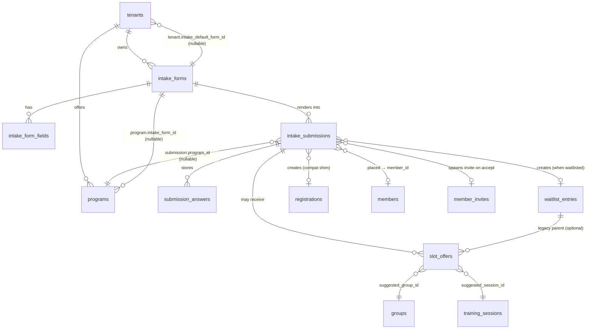
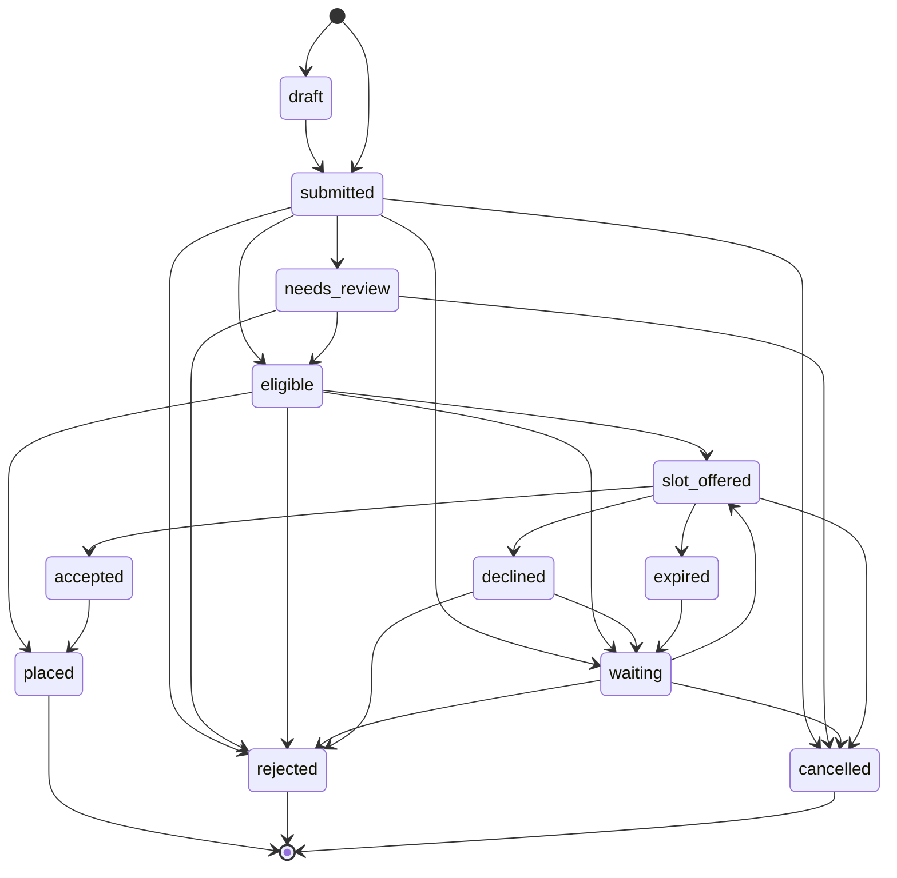

# Dynamic intake & placement — onderzoek & gefaseerd plan

> **Status:** research/planning-deliverable voor Task #99. Geen schema-, route- of code-wijzigingen in deze taak.
> **Scope:** vervang de drie losse publieke-aanmeld-paden (`submitMembershipRegistration`, `submitTryoutRegistration`, `submitPublicRegistration`) door één **dynamisch, programma-gestuurd intake-pipeline** met configureerbare formulieren, een slimme wachtlijst, een placement-assistent voor admins en een generieke slot-offer-flow — bovenop het programs-fundament uit Sprint 60-64.
> **Uitgangspunten:** generiek datamodel (geen sport-hardcoding), additief (oude flows blijven werken via shim), per-tenant feature-flag, Houtrust mag niet stuk.

---

## TL;DR — vijf dingen om te onthouden

1. **Programs zijn de spil, niet registrations.** Sinds Sprint 60-64 zijn programs de bladerbare aanbod-eenheid en levert `program_capacity_overview` al een live capaciteitsbeeld. Het ontbrekende stuk is **één intake-pipeline** die op program-niveau bepaalt *welke knop* een prospect krijgt (inschrijven / proefles / wachtlijst / info-aanvraag), *welke vragen* gesteld worden, en *waar* het antwoord landt.
2. **Eén submission-tabel met submission_type, niet vier.** `intake_submissions` vervangt logisch `registrations`, `tryout_registrations` (bestaat niet apart — leeft in `registrations.type='tryout'`) en de directe-naar-`waitlist_entries`-shortcut van Sprint 49. De oude tabellen blijven bestaan; de compatibility-shim in `submitMembershipRegistration` en `submitTryoutRegistration` schrijft **dubbel** zodat oude reads (`/tenant/registrations`) nooit breken.
3. **Form-config is data, geen code.** `intake_forms` + `intake_form_fields` levert een Zod-schema-at-runtime en een renderer die text/select/multiselect/checkbox/date/number/textarea + `show_if`-conditional ondersteunt. Cascade: `program.intake_form_id → tenant.intake_default_form_id → built-in sector default`. Geen sport-vragen meer in `tryout-form.tsx`.
4. **Placement-assistent is advisory-only, leesbaar binnen één scherm.** Een RPC `score_placement_candidates(submission_id)` geeft een ranked lijst `(group_id, session_id?)` met componentscores (capacity_match, time_pref_match, location_pref_match, age_match, level_match) — hergebruikt `program_capacity_overview` (Sprint 62) en `session_instructors_effective` (Sprint 57). Admin doet altijd de definitieve plaatsing; auto-place is bewust **out of scope** voor MVP.
5. **Slot-offer is generiek, niet alleen voor wachtlijst.** We promoveren `waitlist_offers` naar `slot_offers` met `submission_id` als primaire link en `entry_id`/`group_id`/`session_id`/`program_id` als optionele context. Decision-token, expiry, accept/decline-pagina en notification-dedup (Sprint 41/43-patroon) blijven exact zoals nu — alleen breder bruikbaar.

---

## 1. Huidige-staat-analyse

### 1.1 Drie publieke aanmeld-paden vandaag

| Pad | Server-action | Schrijft naar | Doel | Sinds |
|---|---|---|---|---|
| **Proefles-formulier** `/t/[slug]/proefles` | `submitTryoutRegistration` | `registrations (type='tryout', membership_status='new')` | Vrijblijvende kennismaking; admin neemt contact op | Sprint 7 |
| **Statisch inschrijfformulier** (legacy `MembershipRegistrationForm`) | `submitMembershipRegistration` | `registrations (type='registration', membership_status='aspirant')` of (Sprint 49+) `waitlist_entries` | Aspirant-lid-aanmelding | Sprint 7 + 49 routing |
| **Wizard** `/t/[slug]/inschrijven` | `submitPublicRegistration` | `members` (+ `member_links`, `member_invites`) of (Sprint 64) `waitlist_entries` | Volwaardige onboarding met parent/kind/koppelcode-modes | Sprint 23 + 63/64 |

**Vragen die vandaag hardcoded in code staan**, niet in een tabel:

- `tryout-form.tsx` — `player_type`-radio met opties `player`/`goalkeeper` (voetbal-specifiek), `date_of_birth` als `DateSelectField`, `extra_details`-textarea, terms-checkbox.
- `MembershipRegistrationForm` (legacy) — adres, postcode, woonplaats, athletes-array (kind-modus), `player_type`.
- Wizard (`RegistrationWizard`) — `account_type` (parent/adult_athlete/trainer/staff), `first_name`/`last_name`, children-array met `mode: new|link`, koppelcode-flow, optionele `program_id` via deeplink.

**Validation:** Zod-schemas in `src/lib/validation/public-registration.ts` (`publicTryoutSchema`, `publicMembershipRegistrationSchema`, `publicOnboardingSchema`). Drie aparte schemas die voor 70% overlappen (contact info, terms, target).

### 1.2 Tabellen rond intake (huidige status)

| Tabel | Sprint | Rol | Limitatie t.o.v. dynamic intake |
|---|---|---|---|
| `registrations` | 3 (sprint3 schema) | Statische landing-tafel voor 2 van de 3 publieke flows. Kolommen: `parent_name`, `parent_email`, `child_name`, `child_age`, plus uitbreidingen `type`, `registration_target`, `player_type`, `address`, `athletes_json`, `extra_details`, `agreed_terms`, `membership_status`. | Sport-hardcoded kolommen; geen relatie naar `programs`; geen status-machine; `child_age` legacy en niet meer in gebruik. |
| `waitlist_entries` | 49 | Wachtlijst-rij; kan via Sprint 64 een `program_id` hebben; spiegelt half de registrations-kolommen. | Geen koppeling met form-antwoorden buiten de hardcoded velden; geen `priority_date`, geen `preferences_json`, geen `capacity_snapshot_json`. |
| `waitlist_offers` | 49 (+ 55: TTL/used_at) | Aanbod-rij met `decision_token` + `expires_at` + `status`. | Token-flow is bruikbaar — alleen `entry_id` is verplicht; geen `submission_id`, geen `session_id`, geen `auto_place_on_accept`. |
| `members` + `member_invites` | 23 | Canoniek persoon + invite-flow met `invite_code`/`invite_token`. | Onveranderd geschikt — dynamic intake schrijft hier alleen bij `submission_type='registration'` na admin-acceptatie of (in wizard) bij directe self-service. |
| `programs` | 60 | Aanbod-eenheid met `visibility`, `public_slug`, `marketing_*`. | Mist `intake_form_id`, `submission_types_enabled`-config en `slot_offer_settings`. |
| `program_capacity_overview` (view) | 62 | Live tellingen van filled/free capaciteit per program × group. | Direct herbruikbaar door de placement-RPC — geen wijziging nodig. |
| `tenants.settings_json.intake_default` + `.intake_overrides_by_target` + `.intake_overrides_by_program` | 49/64 | Tenant-default routing registration↔waitlist. | Cascade blijft, krijgt extra niveau `intake_default_form_id` en feature-flag `dynamic_intake_enabled`. |
| `sector_terminology` keys | 36/47 | Per-tenant labels. | Krijgt nieuwe keys `intake_form_singular/plural`, `submission_type_*`, `slot_offer_*` per sector. |

### 1.3 Tenant-admin views vandaag

| Route | Toont | Schrijft tegen |
|---|---|---|
| `/tenant/registrations` | Lijst `registrations`-rijen (incl. tryouts), badge + status-select + convert-button | `registrations` |
| `/tenant/registrations/instellingen` | Tenant-niveau intake-default + per-target overrides + per-program overrides (Sprint 64) | `tenants.settings_json` |
| `/tenant/wachtlijst` (niet-bestaand) | — | — |
| `/tenant/programmas` | Programs-CRUD (Sprint 60-62) | `programs`, `program_groups`, `program_instructors`, `program_resources` |

### 1.4 RLS-status

- `registrations.registrations_public_insert` = `with check (true)` → anon mag inserten. Tenant-admin leest via `has_tenant_access(tenant_id)`.
- `waitlist_entries`, `waitlist_offers` = alleen `tenant_all` policy; publieke writes lopen via service-role action (defense-in-depth in app-laag).
- `members`, `member_invites` = service-role schrijft, tenant-admin/lid leest via eigen sub-policies.

### 1.5 E-mailtemplates (huidige seeds in `email/default-templates.ts`)

- `welcome_member`, `welcome_tryout`, `account_invite`, `staff_invite`, `parent_register_then_link`, `parent_link_with_code`, `parent_link_minor`, `minor_added`, `athlete_code_link`, `invite_reminder`, `invite_expired`, `registration_converted`, `notification`, `newsletter`, `payment_*`, `complete_account`, `group_announcement`.
- **Mist** voor de nieuwe pipeline: `intake_submitted`, `intake_waitlisted`, `intake_placed`, `slot_offered`, `slot_accepted`, `slot_declined`, `slot_expired`.

### 1.6 Notification dedup (Sprint 41/43/53/55/57/64)

Partial unique index `notifications_source_idem_uq` met whitelist van bestaande sources; matching predicate in `create_notification_with_recipients`. Het pattern is om bij elke nieuwe `notifications.source`-key drop+recreate van de index + RPC te doen. Dynamic intake breidt dezelfde whitelist uit (zie §12).

---

## 2. Probleemanalyse — waar het vandaag breekt

| Probleem | Symptoom | Oorzaak |
|---|---|---|
| **P1.** Drie aparte intake-paden voor wat conceptueel één ding is. | Tenant-admin moet `/tenant/registrations` (statisch + tryout) **én** `members/aspirant` (wizard-output) **én** wachtlijst-uitkomsten (geen UI!) op verschillende plekken bekijken. Houtrust gebruikt alleen pad 1; zwemscholen mengen pad 2+3. | Historisch gegroeid; geen unificerend datamodel. |
| **P2.** Sport-hardcoded vragen. | Een nieuwe sector (judo, dansschool, muziekschool) krijgt vandaag of een nutteloze `player_type`-radio of moet eigen code merge'n. | Velden leven als TSX in `tryout-form.tsx` + Zod in `public-registration.ts`. |
| **P3.** Wachtlijst-entries zijn arm. | Admin moet handmatig prospects matchen tegen vrije plekken; geen preferenties (welke dag, welke locatie), geen priority-date (sinds wanneer staat iemand op de lijst t.o.v. een aanmeldmoment), geen capacity-snapshot (hoeveel plekken waren er op het aanmeldmoment?). | Sprint 49 deed expliciet MVP-scope. |
| **P4.** Placement is "in het hoofd van de admin". | Bij 50 wachtenden en 8 groepen wordt het puzzelen; admin opent meerdere tabs (`/tenant/wachtlijst`, `/tenant/groepen/[id]`, `program_capacity_overview` via SQL) en raadt. | Geen tool die suggesties geeft. |
| **P5.** Trial-lesson is een aparte route met eigen formulier. | Op een nieuwe tenant die zowel proeflessen als directe inschrijvingen wil, moeten beide formulieren onafhankelijk worden onderhouden. | Proefles bestaat sinds Sprint 7 als parallelle UI, niet als submission_type. |
| **P6.** Geen onderscheid "draft" / "submitted" / "needs_review". | Prospects die het formulier halverwege verlaten zijn onzichtbaar; admins kunnen niet flaggen "ik wacht nog op info van de ouder". | `registrations.status`-enum is per-tabel verschillend en niet expliciet status-machine. |
| **P7.** Slot-offer-flow zit gevangen in waitlist-context. | Een admin die een direct-toegewezen plek wil aanbieden ("we hebben morgen een plek vrij — wil je 'm?") moet vandaag of een dummy waitlist_entry aanmaken of buiten het systeem mailen. | `waitlist_offers.entry_id` is `not null`. |
| **P8.** E-mail-flow is template-name-gestuurd vanuit code, niet vanuit status-transitie. | Een nieuwe transitie ("submission → waitlisted") vergt code in 2 plekken. | Geen mapping table `submission_status → email_template_key`. |

---

## 3. Voorgestelde architectuur

### 3.1 ER-diagram (mermaid)



### 3.2 Cascade voor "welk form gebruiken we?"

```
program.intake_form_id
  └─ if NULL → tenant.intake_default_form_id
       └─ if NULL → built-in sector default (in code, niet in DB)
```

Sector-defaults leven in `lib/intake/sector-defaults.ts` als statische config en worden in §6 uitgewerkt. Reden om ze **niet** als seed-rij in `intake_forms` te zetten: dan kan een tenant ze niet "resetten naar fabrieksinstellingen". Door ze code-side te houden is fallback altijd voorspelbaar en is reset = delete + cascade.

### 3.3 Cascade voor "welke submission_types zijn beschikbaar op deze program?"

```
program.submission_types_enabled (jsonb array, default null = inherit)
  └─ if NULL → tenant.intake_submission_types_default (jsonb array)
       └─ if NULL → ['registration']  (built-in safe default)
```

Mogelijke waarden: `'registration'`, `'trial_lesson'`, `'waitlist_request'`, `'information_request'`. Een program voor "Diploma B" zou bijvoorbeeld `['registration','waitlist_request']` enablen; "Watergewenning" misschien `['trial_lesson','registration']`.

### 3.4 Public flow (renderer-kant)

```
Anon bezoekt /t/[slug]/programmas/[publicSlug]
  → Detail-page leest:
      - program (Sprint 63 al)
      - effective intake_form via cascade
      - effective submission_types_enabled
  → Toont N CTA-knoppen, één per enabled submission_type
      met labels uit terminology (zie §13)
Anon klikt "Schrijf in voor proefles"
  → Route /t/[slug]/inschrijven?program=<publicSlug>&type=trial_lesson
  → Dynamic renderer bouwt form uit intake_form_fields
  → Submit → action submitIntake({...payload, submission_type, program_id})
      → 1 rij in intake_submissions (status='submitted')
      → 0..N rijen in submission_answers
      → e-mail intake_submitted naar prospect
      → (optioneel) e-mail naar tenant-admin queue
      → eventueel direct geclassificeerd als waitlist_request → status 'waiting'
```

### 3.5 Admin flow

```
Admin opent /tenant/intake
  → Lijst van intake_submissions, filter op submission_type + status + program
  → Klik op één rij → detail
      - alle answers (key/value)
      - "Plaatsingssuggesties" panel (RPC call)
      - knoppen: Plaats in groep X → status='placed', materialiseer member
                 Stuur slot-offer → maak slot_offer met decision_token
                 Naar wachtlijst → status='waiting', kopieer naar waitlist_entries
                 Afwijzen → status='rejected'
                 Markeer needs_review → admin-flag
```

---

## 4. Datamodel-voorstel — tabel-voor-tabel

> Labels: **N**=new table, **C**=new column, **M**=migration/backfill, **V**=view, **R**=RPC, **U**=UI-only, **L**=later phase.

### 4.1 `intake_forms` — N

| Kolom | Type | Notes |
|---|---|---|
| id | uuid pk | |
| tenant_id | uuid not null fk tenants | RLS via `has_tenant_access` |
| slug | text not null | unique per tenant; tenant-admin kiest |
| name | text not null | label in admin-UI |
| description | text | |
| status | text not null default 'draft' | enum: `'draft'`, `'published'`, `'archived'` |
| is_default | bool not null default false | partial unique index `(tenant_id) where is_default=true` |
| settings_json | jsonb default '{}' | future hook (i18n, conditional logic complexer dan show_if) |
| created_at / updated_at | timestamptz | met `handle_updated_at` trigger |

**Unique:** `(tenant_id, slug)`.

### 4.2 `intake_form_fields` — N

| Kolom | Type | Notes |
|---|---|---|
| id | uuid pk | |
| tenant_id | uuid not null | composite-FK pattern (Sprint 60): `(form_id, tenant_id)` → `intake_forms(id, tenant_id)` |
| form_id | uuid not null | |
| key | text not null | machine-key; unique per form; bv. `parent_email`, `swimming_experience`, `preferred_day` |
| label | text not null | gerenderde label |
| help_text | text | |
| field_type | text not null | enum: `'text'`, `'textarea'`, `'email'`, `'phone'`, `'date'`, `'number'`, `'select'`, `'multiselect'`, `'checkbox'`, `'radio'`, `'consent'` |
| is_required | bool not null default false | |
| options_json | jsonb | voor select/multiselect/radio: `[{value, label}]` |
| validation_json | jsonb | bv. `{min:1,max:5}`, `{pattern:"..."}`, `{maxLength:1500}` |
| show_if_json | jsonb | conditional: `{field_key:'registration_target', equals:'child'}` — single-clause MVP; `and`/`or` later |
| sort_order | int not null default 0 | |
| pii_class | text not null default 'standard' | `'standard'`/`'sensitive'` — drives audit redaction |
| canonical_target | text | optioneel: `'parent_email'`/`'parent_phone'`/`'date_of_birth'`/etc. → tells the materializer welke `members`/`waitlist_entries`-kolom dit antwoord vult |
| created_at / updated_at | timestamptz | |

**Unique:** `(form_id, key)`. **Composite-FK:** `(form_id, tenant_id) → intake_forms(id, tenant_id)`.

### 4.3 `intake_submissions` — N

| Kolom | Type | Notes |
|---|---|---|
| id | uuid pk | |
| tenant_id | uuid not null | |
| program_id | uuid | composite-FK `(program_id, tenant_id) → programs(id, tenant_id)`; nullable (info-aanvragen zonder program) |
| form_id | uuid not null | composite-FK |
| submission_type | text not null | enum (zie §5) |
| status | text not null default 'submitted' | enum (zie §5) |
| **Denormalized contact-cache** (voor lijst-rendering zonder join naar submission_answers): | | |
| contact_name | text | resolved uit answers via `canonical_target` |
| contact_email | text | |
| contact_phone | text | |
| contact_date_of_birth | date | |
| registration_target | text | `self`/`child`/null |
| **Routing-context:** | | |
| priority_date | timestamptz not null default now() | bewaart "sinds wanneer staat deze persoon in de queue" — onafhankelijk van created_at zodat admin-correctie mogelijk is |
| preferences_json | jsonb default '{}' | `{preferred_days:["mon","wed"], preferred_locations:["bad-zuid"], age_band:"6-8"}` — extract van form-answers door materializer |
| capacity_snapshot_json | jsonb default '{}' | snapshot uit `program_capacity_overview` op moment van submit (free seats per group) — analytisch |
| assigned_member_id | uuid | fk members; gezet zodra `status='placed'` |
| assigned_group_id | uuid | composite-FK `(group_id, tenant_id) → groups(id, tenant_id)` |
| compat_registration_id | uuid | fk registrations; gezet door shim wanneer dubbel geschreven |
| compat_waitlist_entry_id | uuid | fk waitlist_entries; idem |
| reviewed_by | uuid fk auth.users | gezet bij admin-acties |
| reviewed_at | timestamptz | |
| extra_details | text | back-compat veld; valt 1-op-1 op de oude `extra_details` |
| agreed_terms | bool not null default false | |
| created_at / updated_at | timestamptz | trigger |

**Indexen:** `(tenant_id, status, created_at desc)`, `(tenant_id, program_id, status)`, `(tenant_id, lower(contact_email))`, `(form_id)`.

### 4.4 `submission_answers` — N

| Kolom | Type |
|---|---|
| id | uuid pk |
| tenant_id | uuid not null |
| submission_id | uuid not null (composite-FK met tenant_id) |
| field_id | uuid not null (composite-FK met tenant_id naar form_fields) |
| field_key | text not null | gedenormaliseerd voor query-gemak |
| value_text | text |
| value_number | numeric |
| value_date | date |
| value_bool | bool |
| value_json | jsonb | voor multiselect of complexe types |
| created_at | timestamptz |

**Unique:** `(submission_id, field_id)`. Eén rij per veld per submission. Reden voor expliciete typed kolommen ipv puur jsonb-blob: makkelijker te indexeren voor filters ("toon alle waitlist_requests met preferred_day=woensdag") en respecteert PII-class voor audit-redaction.

**Alternatief overwogen:** alles in `intake_submissions.answers_json` blob. **Verworpen** want: (a) geen query-flexibiliteit; (b) geen FK terug naar `intake_form_fields` voor schema-evolutie; (c) audit-redaction wordt lastiger.

### 4.5 `slot_offers` — N (vervangt logisch `waitlist_offers`)

| Kolom | Type | Notes |
|---|---|---|
| id | uuid pk | |
| tenant_id | uuid not null | |
| submission_id | uuid | composite-FK; nullable voor backwards-compat met losse waitlist_entry-aanbiedingen |
| waitlist_entry_id | uuid | composite-FK; nullable; alleen gevuld voor legacy paths |
| program_id | uuid | composite-FK |
| suggested_group_id | uuid | composite-FK |
| suggested_session_id | uuid | composite-FK |
| decision_token | text not null unique | tokens worden gegenereerd met `gen_random_bytes(24)`-base64url |
| expires_at | timestamptz not null | TTL configureerbaar via tenant-instelling, default 7 dagen |
| status | text not null default 'pending' | enum: `pending`, `accepted`, `declined`, `expired`, `cancelled` |
| decided_at | timestamptz | |
| used_at | timestamptz | one-time-use (zoals milestone_event_invites in Sprint 55) |
| auto_place_on_accept | bool not null default true | indien `false`: admin moet alsnog handmatig plaatsen |
| created_by | uuid fk auth.users | |
| created_at | timestamptz | |

**Migratie van `waitlist_offers`:** zie §14. Korte versie: backfill `slot_offers` uit bestaande rijen + view `waitlist_offers` (security_invoker) die `slot_offers WHERE waitlist_entry_id IS NOT NULL` exposeert voor 1 release om bestaande UI/queries niet te breken.

### 4.6 Wijzigingen op bestaande tabellen

| Tabel | Kolom | Type | Label | Reden |
|---|---|---|---|---|
| `tenants` | `settings_json.dynamic_intake_enabled` | bool | C (config-only) | Per-tenant feature-flag (zie §14). |
| `tenants` | `settings_json.intake_default_form_id` | uuid | C (config-only) | Tenant-default form. |
| `tenants` | `settings_json.intake_submission_types_default` | jsonb | C (config-only) | Lijst van enabled types op tenant-niveau. |
| `tenants` | `settings_json.slot_offer_ttl_hours` | int | C (config-only) | Default TTL voor slot_offers. |
| `programs` | `intake_form_id` | uuid | C | Override per program. |
| `programs` | `submission_types_enabled` | jsonb | C | Override per program. |
| `programs` | `trial_lesson_enabled` | bool not null default false | C | Helper-flag (afgeleid uit `submission_types_enabled`); cached voor query-snelheid op marketplace. Gehouden in sync via trigger. |
| `waitlist_entries` | `intake_submission_id` | uuid | C | Backwards-link bij dubbel-schrijven. |
| `registrations` | `intake_submission_id` | uuid | C | Idem. |
| `members` | `intake_submission_id` | uuid | C | Sourcing-link bij `placed`. |
| `member_invites` | `intake_submission_id` | uuid | C | Sourcing-link. |

**Wat doen we met `registrations`?**

- **Optie A (gekozen):** tabel blijft staan, krijgt nullable `intake_submission_id`. Compat-shim in `submitMembershipRegistration` schrijft eerst `intake_submissions`, dan `registrations` (dubbel). Bestaande `/tenant/registrations`-page blijft 1-op-1 werken. Na N maanden mag `registrations` deprecated worden via een feature-flag die de page herrouteert naar `/tenant/intake`.
- **Optie B (verworpen):** vervang `registrations` direct door een view bovenop `intake_submissions`. Verworpen want te risicovol — `RegistrationStatusSelect`, `ConvertRegistrationButton`, server-actions schrijven nog rechtstreeks; te veel oppervlakte voor één sprint.

### 4.7 Views & RPC's

- **V** `intake_submission_summary` — joins `intake_submissions` × `intake_forms` × `programs` × `members`-of-`waitlist_entries`-counterpart voor admin-lijst (security_invoker).
- **V** `program_intake_funnel` — analytics: per program, per status, count + avg time-to-decision. Later (Phase 5).
- **R** `score_placement_candidates(submission_id uuid)` — zie §9.
- **R** `accept_slot_offer(decision_token text)`, `decline_slot_offer(decision_token text)`, `expire_stale_slot_offers()` (cron) — zie §10.

---

## 5. Submission-type & status-machine

### 5.1 Enum-waarden

**`submission_type`** (zal als check-constraint geïmplementeerd worden, niet als `pg_enum` — Sprint 49-stijl, eenvoudiger te wijzigen):

| Waarde | Betekenis |
|---|---|
| `registration` | Wil direct lid worden / inschrijven |
| `trial_lesson` | Wil eerst een proefles |
| `waitlist_request` | Bewuste keuze "zet me op de wachtlijst voor program X" |
| `information_request` | "Bel me terug / stuur me info" — geen verplichting tot plaatsing |

**`status`:**

| Waarde | Mag toegekend worden door | Betekenis |
|---|---|---|
| `draft` | submitter (toekomstige feature, niet in MVP) | Half-ingevuld formulier; visueel onder "verlaten aanvragen" |
| `submitted` | submitter | Net binnen, nog niet bekeken |
| `needs_review` | admin | Admin heeft 'm geopend en wacht op extra info |
| `eligible` | admin / auto | Klaar voor plaatsing of slot-offer; alle screening-vragen ok |
| `waiting` | admin / auto (bij submission_type='waitlist_request') | Op de wachtlijst |
| `slot_offered` | admin | Een slot_offer is open |
| `accepted` | submitter via token | Slot-offer geaccepteerd |
| `declined` | submitter via token | Slot-offer afgewezen door submitter |
| `expired` | cron | Slot-offer is verlopen |
| `placed` | admin / auto bij accept | Member is aangemaakt of bestaande member gekoppeld |
| `cancelled` | admin of submitter | Submitter trekt aanvraag in / admin cancelt |
| `rejected` | admin | Admin wijst af zonder offer |

### 5.2 Status-transitions (mermaid)



### 5.3 Audit-keys

Eén namespace `intake.*`:

- `intake.submission.created` (anon submit)
- `intake.submission.status_changed` (admin transitie; meta: `{from, to, reason}`)
- `intake.submission.placed` (meta: `{member_id, group_id}`)
- `intake.submission.merged` (later — bij dedup van dubbele inzendingen)
- `intake.form.created` / `intake.form.updated` / `intake.form.published` / `intake.form.archived`
- `intake.form.field_added` / `intake.form.field_updated` / `intake.form.field_removed`
- `intake.slot_offer.sent` (meta: `{offer_id, group_id, session_id, ttl_hours}`)
- `intake.slot_offer.accepted` / `intake.slot_offer.declined` / `intake.slot_offer.expired` / `intake.slot_offer.cancelled`

Audit-pattern volgt bestaande `audit_logs`-table en `logAudit`-helper; geen schemawijziging.

---

## 6. Dynamic form-renderer

### 6.1 Supported field-types (MVP)

| `field_type` | UI | Zod-built-at-runtime |
|---|---|---|
| `text` | `<input type="text">` | `z.string().min(...).max(...)` |
| `textarea` | `<textarea>` | idem + maxLength |
| `email` | `<input type="email">` | `z.string().email()` |
| `phone` | `<input type="tel">` | `z.string().regex(/^[\d +()-]{6,}$/)` |
| `date` | `DateSelectField` | `z.string().regex(/^\d{4}-\d{2}-\d{2}$/)` |
| `number` | `<input type="number">` | `z.coerce.number().min().max()` |
| `select` | `<select>` | `z.enum(options.map(o => o.value))` |
| `multiselect` | shadcn multi-combobox | `z.array(z.enum(...))` |
| `radio` | `<input type="radio">` group | `z.enum(...)` |
| `checkbox` | single boolean | `z.boolean()` |
| `consent` | terms-checkbox-styled | `z.literal(true)` |

**Later (Phase 4):** `file_upload` (link naar object-storage), `signature`, `address` (composite postcode/huisnr/straat met PostNL-lookup).

### 6.2 Conditional logic — `show_if_json`

MVP: één clause per veld.

```jsonc
{
  "field_key": "registration_target",
  "equals": "child"
}
```

Implementatie: renderer watch't de geconfigureerde key via React Hook Form `watch()`; veld is `display:none` als clause niet matcht; ook geen Zod-validatie op verborgen velden.

**Later (Phase 4):** `or`/`and`-trees, `not_equals`, `in`, `not_in`.

### 6.3 Renderer-architectuur

```
<DynamicIntakeForm
  form={intakeForm}     // includes fields
  defaults={...}         // optional prefill via deeplink
  onSubmit={(values) => submitIntake({...})}
/>
```

Internals:

- Build Zod-schema at runtime in `lib/intake/build-schema.ts` (memoized by form.id + updated_at).
- Build defaultValues object van fields.
- Use React Hook Form + `zodResolver`.
- Eén component per field_type in `components/public/intake/fields/`.
- Server-side validation **opnieuw**: action `submitIntake` doet exact dezelfde Zod-build op basis van geladen `intake_forms` + `intake_form_fields` — nooit vertrouwen op client-built schema.

### 6.4 i18n / locale

NL-only voor MVP. `intake_forms.locale` kolom voorbereiden als nullable (NL fallback) voor toekomstige multi-language tenants. Labels/help_text/options blijven UTF-8 plain text — geen Markdown-render in MVP.

---

## 7. Trial-lesson als optie

### 7.1 Vandaag → straks

| Vandaag | Straks |
|---|---|
| Route `/t/[slug]/proefles` + `TryoutForm` + `submitTryoutRegistration` | Route blijft bestaan; redirect `/t/[slug]/proefles` → `/t/[slug]/inschrijven?type=trial_lesson` zodra tenant `dynamic_intake_enabled=true` zet. Anders blijft TryoutForm gewoon werken (geen forced migration). |
| Hardcoded `player_type`-vraag | Built-in sector default form (football) heeft `player_type` als veld; swimming-default niet. |
| Geen program-koppeling | `?program=` deeplink propageert door naar trial_lesson; admin ziet direct welk program de prospect wil proeven. |

### 7.2 Sturen wie trial mag aanbieden

Cascade `program.submission_types_enabled` (override) → `tenant.intake_submission_types_default`. Marketplace-detail-page rendert per enabled submission_type één CTA-knop met label uit terminology.

### 7.3 Deprecation-pad voor `/t/[slug]/proefles`

- Fase 1 (Sprint 65 MVP): route ongewijzigd, nieuwe pipeline draait parallel.
- Fase 3 (Sprint 67): wanneer tenant `dynamic_intake_enabled=true` zet, `/proefles`-page rendert een **server-side redirect** naar `/inschrijven?type=trial_lesson` (preserve `?program=`).
- Fase 6 (Sprint 7x, na 6 maanden 100% adoptie): route verwijderen.

---

## 8. Smart waitlist MVP

### 8.1 Bestaand fundament (Sprint 49 + 64)

`waitlist_entries` heeft al: contact-velden, `tenant_id`, `program_id`, `status`-enum, `priority`, `source`.

### 8.2 Wat ontbreekt

| Veld | Type | Doel |
|---|---|---|
| `priority_date` | timestamptz | Onafhankelijk van `created_at` zodat admin een lid van een oude lijst kan migreren met behoud van wachttijd. |
| `preferences_json` | jsonb | Voorkeuren gewonnen uit `submission_answers` (`preferred_days`, `preferred_locations`, `age_band`, `level_band`). |
| `capacity_snapshot_json` | jsonb | Snapshot uit `program_capacity_overview` op aanmeldmoment — voor analytics ("was er destijds plek?"). |
| `intake_submission_id` | uuid | Link terug naar oorspronkelijke submission. |

### 8.3 Admin-overzicht UI

Nieuwe route `/tenant/wachtlijst`:

- Lijst grouped by program (collapsible cards).
- Filters: program, voorkeur-dag, voorkeur-locatie, leeftijdsbereik, status, source.
- Per rij: contact-naam + email + telefoon, priority_date, voorkeuren-pill-row, knoppen "Plaats", "Aanbieden", "Cancel".
- Bulk-actie: "Aanbieden aan top-N voor groep X" (later — Phase 4).

### 8.4 Filter-implementatie

Postgres jsonb-operators op `preferences_json`:

```sql
where preferences_json -> 'preferred_days' ? 'mon'
  and preferences_json -> 'preferred_locations' ? 'bad-zuid'
```

Index: `create index waitlist_entries_prefs_gin on waitlist_entries using gin (preferences_json)`.

---

## 9. Placement-assistent

### 9.1 RPC-signatuur

```sql
create or replace function public.score_placement_candidates(
  p_submission_id uuid
) returns table (
  group_id           uuid,
  session_id         uuid,                  -- nullable; first matching session
  total_score        numeric,               -- 0..100
  capacity_match     numeric,               -- 0..100
  time_pref_match    numeric,
  location_pref_match numeric,
  age_match          numeric,
  level_match        numeric,
  free_seats         int,
  rationale_json     jsonb                  -- per-component motivatie
)
language plpgsql
security definer
set search_path = public
as $$ ... $$;
```

### 9.2 Scoring-formule (MVP)

`total_score = 0.30·capacity + 0.25·time + 0.20·location + 0.15·age + 0.10·level`.

- **capacity_match:** uit `program_capacity_overview` — full = 0, ≥3 vrije plaatsen = 100, lineair daartussen.
- **time_pref_match:** vergelijk `preferences_json.preferred_days` × `training_sessions.starts_at::dow`; 100 als minstens één sessie van de groep op een voorkeursdag valt; 50 bij gedeeltelijke match (>=1 sessie binnen 2 dagen); 0 bij geen match.
- **location_pref_match:** vergelijk `preferences_json.preferred_locations` × `groups.default_location` of `training_sessions.location`.
- **age_match:** vergelijk `contact_date_of_birth` met `groups.age_min`/`age_max` (Sprint 42-kolommen).
- **level_match:** vergelijk `preferences_json.level_band` met `groups.level_band` (Sprint 51-kolom).

### 9.3 Performance-budget

Max 50 groups in scope per query (filter op `program_id` of `tenant_id` + relevante leeftijdsband). RPC moet < 200 ms p95. Hergebruik view `program_capacity_overview` — die heeft al de filled/free-count.

### 9.4 Wat het **niet** doet

- Geen auto-plaatsing. Resultaat is altijd advisory.
- Geen meerdere submissions tegelijk (zou multi-objective optimization vereisen — later phase).
- Geen instructor-mismatch detection (`session_instructors_effective` is een leesbron; we filteren niet op understaffed sessions).

### 9.5 Toekomstige extensies

- Inhaal-credits (Sprint 50-`makeup_credits`) → 6e component `makeup_match` voor inhaal-plaatsing.
- Flow-through (lid promoveert van Diploma A → B) → input `current_program_id`.

---

## 10. Slot-offer-flow generiek

### 10.1 Token-generatie

`decision_token = encode(gen_random_bytes(24), 'base64')` met url-safe replace (`+→-`, `/→_`, `=`-strip). Lengte ~32 chars.

### 10.2 Publieke decision-pagina

Route: `/o/[token]` (kort pad — geen tenant-slug nodig; token is globaal uniek).

- `GET`: lookupt `slot_offers` via token (RLS allow `anon` SELECT WHERE `decision_token = ?` AND `expires_at > now()` AND `used_at IS NULL`). Toont program/group/session-info + accept/decline-buttons.
- `POST accept` → RPC `accept_slot_offer(token)` zet `status='accepted'`, `decided_at=now()`, `used_at=now()`; promoveert `intake_submissions.status='accepted'→'placed'` indien `auto_place_on_accept=true`; spawnt invite (`member_invites`-row); stuurt e-mails.
- `POST decline` → RPC `decline_slot_offer(token, reason text)` zet `status='declined'`; `intake_submissions.status='waiting'` (terug op de lijst).

### 10.3 Expiry handling

Cron job (bestaande `pg_cron`-stack) draait elke 10 min `expire_stale_slot_offers()`:

```sql
update slot_offers
   set status='expired', used_at=now()
 where status='pending' and expires_at < now();
```

Voor elke geëxpireerde offer: notify admin via existing notifications-stack (source `slot_offer_expired`).

### 10.4 RLS (security-by-design — geen anon table-policy)

**Definitief besluit:** geen anon `SELECT`-policy op `slot_offers`. Anonieme toegang loopt **uitsluitend** via een `security definer`-RPC die token + lookup combineert in één call, zodat RLS-enumeratie principieel onmogelijk is.

```sql
alter table slot_offers enable row level security;

-- Tenant-admin CRUD: enige directe table-policy
create policy "slot_offers_tenant_all" on slot_offers
  for all using (has_tenant_access(tenant_id))
          with check (has_tenant_access(tenant_id));

-- Lid/ouder mag eigen offer zien (via submission-link)
create policy "slot_offers_member_read_own" on slot_offers
  for select using (
    exists (
      select 1 from intake_submissions s
       join members m on m.id = s.assigned_member_id
       where s.id = slot_offers.submission_id
         and m.user_id = auth.uid()
         and m.tenant_id = slot_offers.tenant_id
    )
  );

-- Géén "for select to anon" policy. Punt.
-- Anonieme decision-page leest uitsluitend via deze RPC:
create or replace function public.get_slot_offer_for_decision(p_token text)
returns table (
  offer_id           uuid,
  program_name       text,
  group_name         text,
  session_starts_at  timestamptz,
  expires_at         timestamptz,
  status             text
)
language plpgsql
security definer
set search_path = public
as $$
begin
  -- Strikte filter: precies één token, niet gebruikt, niet verlopen, status='pending'.
  return query
  select so.id, p.name, g.name, ts.starts_at, so.expires_at, so.status
    from public.slot_offers so
    left join public.programs p          on p.id  = so.program_id
    left join public.groups g            on g.id  = so.suggested_group_id
    left join public.training_sessions ts on ts.id = so.suggested_session_id
   where so.decision_token = p_token
     and so.used_at is null
     and so.expires_at > now()
     and so.status = 'pending'
   limit 1;
end;
$$;

revoke all on function public.get_slot_offer_for_decision(text) from public;
grant execute on function public.get_slot_offer_for_decision(text) to anon, authenticated;
```

Equivalent voor `accept_slot_offer(token)` en `decline_slot_offer(token, reason)`: ook `security definer`, ook met token-equality + freshness-check vóór ze écht muteren. App-laag roept **uitsluitend** deze RPC's aan; er bestaat geen pad waarbij anon direct `from('slot_offers').select(...)` mag uitvoeren.

**Aanvullende mitigaties tegen brute-force-enumeratie:**

- Token-entropie 192 bit (`gen_random_bytes(24)`) — onhaalbaar te raden.
- Rate-limiting op `/o/[token]` route via middleware (Sprint 7x — pre-existing pattern op andere publieke endpoints).
- Constant-time response: RPC retourneert dezelfde shape (lege tabel) bij niet-gevonden / verlopen / gebruikt, zodat oracle-aanvallen geen onderscheid kunnen maken.
- Audit-log: elke `get_slot_offer_for_decision`-aanroep met onbekend token logt `intake.slot_offer.token_miss` (sample-rate 100% in eerste 90 dagen, daarna 10%) zodat scan-pogingen zichtbaar zijn.

### 10.5 Notification dedup-keys (Sprint 41/43-patroon)

Toe te voegen aan `notifications_source_idem_uq` predicate (en sync in `create_notification_with_recipients`):

- `slot_offer_sent` (source_ref = `slot_offers.id`)
- `slot_offer_accepted` (idem)
- `slot_offer_declined` (idem)
- `slot_offer_expired` (idem)
- `intake_submission_placed` (source_ref = `intake_submissions.id`)
- `intake_submission_waitlisted` (idem)

---

## 11. Permission-plan & RLS

### 11.1 Per-rol overzicht

| Rol | `intake_forms` | `intake_form_fields` | `intake_submissions` | `submission_answers` | `slot_offers` |
|---|---|---|---|---|---|
| **platform_admin** | full (alle tenants) | full | full | full | full |
| **tenant_admin** | full (eigen tenant via `has_tenant_access`) | full | full | full | full |
| **tenant_staff** | read | read | read | read | read |
| **trainer/instructor** | n/a | n/a | read alleen submissions met `assigned_group_id` in trainer's groepen | idem | n/a |
| **member** | n/a | n/a | read **eigen** (`assigned_member_id = (members.user_id=auth.uid())`) | idem | read via `submission_id` |
| **parent** | n/a | n/a | read alleen child-rijen via `member_links` | idem | read via `submission_id` |
| **anon (public form)** | read **`status='published'`** rijen voor formulier-render | read same | insert via RPC `submit_intake` (security definer); geen SELECT | insert via RPC; geen SELECT | **geen directe table-toegang**; alléén RPC `get_slot_offer_for_decision(token)` / `accept_slot_offer` / `decline_slot_offer` (zie §10.4) |

### 11.2 Policies per nieuwe tabel (skelet)

```sql
-- intake_forms
alter table intake_forms enable row level security;

create policy "intake_forms_public_read_published" on intake_forms
  for select using (status = 'published');

create policy "intake_forms_tenant_all" on intake_forms
  for all using (has_tenant_access(tenant_id))
          with check (has_tenant_access(tenant_id));

-- intake_form_fields (same pattern; public read via parent join would be costly)
alter table intake_form_fields enable row level security;

create policy "intake_form_fields_public_read" on intake_form_fields
  for select using (
    exists (
      select 1 from intake_forms f
       where f.id = intake_form_fields.form_id
         and f.status = 'published'
    )
  );

create policy "intake_form_fields_tenant_all" on intake_form_fields
  for all using (has_tenant_access(tenant_id))
          with check (has_tenant_access(tenant_id));

-- intake_submissions
alter table intake_submissions enable row level security;

create policy "intake_submissions_tenant_all" on intake_submissions
  for all using (has_tenant_access(tenant_id))
          with check (has_tenant_access(tenant_id));

create policy "intake_submissions_member_read_own" on intake_submissions
  for select using (
    exists (
      select 1 from members m
       where m.id = intake_submissions.assigned_member_id
         and m.tenant_id = intake_submissions.tenant_id
         and m.user_id = auth.uid()
    )
    or exists (
      select 1 from member_links ml
       join members p on p.id = ml.parent_member_id
       where ml.child_member_id = intake_submissions.assigned_member_id
         and p.tenant_id = intake_submissions.tenant_id
         and p.user_id = auth.uid()
    )
  );

-- Geen anon-insert policy: alle public writes via service-role RPC submit_intake.
```

### 11.3 Defense-in-depth voor anon-submit

`submit_intake` RPC is security-definer en valideert:

1. `tenant_id` resolved via slug + `status='active'`.
2. `program_id` indien aanwezig: hoort bij tenant + `visibility='public'` + `public_slug not null`.
3. `form_id` resolved via cascade; `status='published'` verplicht.
4. Alle `submission_answers.field_id` horen bij `form_id`.
5. Required fields zijn aanwezig; types matchen `field_type`.

App-laag (`submitIntake` server-action) doet **dezelfde** validatie via Zod vóór de RPC-call (early friendly errors) — RPC blijft de laatste authority.

---

## 12. E-mail / notification-plan

### 12.1 Nieuwe e-mailtemplates (seed in `email/default-templates.ts`)

| Template-key | Trigger | Variables |
|---|---|---|
| `intake_submitted` | Anon submit | `{program_name, submission_type_label, tenant_name, contact_name}` |
| `intake_waitlisted` | `status → waiting` | `{program_name, contact_name, expected_wait_text}` |
| `intake_placed` | `status → placed` | `{program_name, group_name, start_date, invite_url}` |
| `slot_offered` | `slot_offer` insert | `{program_name, group_name, session_starts_at, decide_url, expires_at}` |
| `slot_accepted` | offer accept | `{program_name, group_name, member_invite_url}` |
| `slot_declined` | offer decline (admin notification) | `{program_name, contact_name, reason}` |
| `slot_expired` | cron expire (admin + submitter) | `{program_name, contact_name}` |
| `intake_info_response` | `submission_type='information_request'` admin reply (later phase) | — |

Templates volgen het bestaande TipTap-rich-mail-pattern. Variabele-resolution gebeurt in `lib/email/render-template.ts` (bestaand).

### 12.2 Per-tenant override

Net als `welcome_member`/`staff_invite` kunnen tenants elke template lokaal overschrijven via `tenant_email_templates`. Lazy-seed bij eerste toegang (Sprint 21-patroon).

### 12.3 Notification dedup-keys (Sprint 41/43/53/55/57/64-patroon)

Drop+recreate van `notifications_source_idem_uq` met nieuwe whitelist-entries (zie §10.5). RPC `create_notification_with_recipients`-predicate spiegelen.

---

## 13. Tenant-terminology-plan

### 13.1 Nieuwe keys

| Key | Doel | Default (generic) | football | swimming |
|---|---|---|---|---|
| `intake_form_singular` | Naam voor 1 formulier | Aanmeldformulier | Aanmeldformulier | Aanmeldformulier |
| `intake_form_plural` | | Aanmeldformulieren | Aanmeldformulieren | Aanmeldformulieren |
| `submission_type_registration` | CTA-label op program-detail | Inschrijven | Word lid | Inschrijven |
| `submission_type_trial_lesson` | | Proefles aanvragen | Proeftraining | Proefles aanvragen |
| `submission_type_waitlist_request` | | Op de wachtlijst | Op de wachtlijst | Op de wachtlijst |
| `submission_type_information_request` | | Meer informatie | Meer informatie | Meer informatie |
| `slot_offer_singular` | Term voor 1 aanbod | Plekaanbieding | Plekaanbieding | Plekaanbieding |
| `slot_offer_plural` | | Plekaanbiedingen | Plekaanbiedingen | Plekaanbiedingen |
| `intake_status_waiting` | Status-label in admin-UI | Op wachtlijst | Op wachtlijst | Op wachtlijst |
| `intake_status_eligible` | | Klaar voor plaatsing | Klaar voor plaatsing | Klaar voor plaatsing |
| `intake_status_placed` | | Geplaatst | Geplaatst | Geplaatst |
| `intake_placement_assistant_title` | Panel-heading | Plaatsingssuggesties | Plaatsingssuggesties | Plaatsingssuggesties |

### 13.2 Schema-update

`src/lib/terminology/types.ts` krijgt deze keys toegevoegd; `src/lib/terminology/defaults.ts` levert per-sector defaults; `src/lib/terminology/schema.ts` valideert overrides; `src/lib/terminology/labels.ts` exposeert NL-labels.

### 13.3 Resolution

Bestaande `getTenantTerminology(tenant)` helper levert al de cascade `tenant_override → sector_default → generic`. Geen architecturale wijziging.

---

## 14. Migratiestrategie

### 14.1 Fasen

| Fase | Wat | Houtrust-impact |
|---|---|---|
| **A — Datamodel additief** | `intake_forms`, `intake_form_fields`, `intake_submissions`, `submission_answers`, `slot_offers` nieuw + nieuwe nullable kolommen op `programs`/`registrations`/`waitlist_entries`/`members`/`member_invites`. Backfill `slot_offers` uit `waitlist_offers`. View `waitlist_offers_legacy_v` voor 1 release. RLS-policies. | Geen — alle oude paden blijven werken; geen kolomwijzigingen op bestaande velden. |
| **B — Feature-flag + sector-default-forms in code** | `tenants.settings_json.dynamic_intake_enabled` toegevoegd; default `false`. Code-side sector-default forms ge-typed. | Nul — flag is uit. |
| **C — Compat-shim in legacy actions** | `submitMembershipRegistration`/`submitTryoutRegistration` schrijven (na hun bestaande insert) óók een `intake_submissions`-rij; `submitPublicRegistration` idem. Status-mapping: `registrations.status='new'→submitted`, `tryout→submitted`. Best-effort: shim faalt stilletjes met log, primaire insert is leidend. | Geen — alle bestaande UI leest nog de oude tabellen; dubbel-schrijven is read-only voor Houtrust. |
| **D — Admin UI `/tenant/intake`** | Nieuwe pagina die `intake_submissions` toont; **geen** vervanging van `/tenant/registrations`. Tenant-admin kan formulieren bouwen onder `/tenant/intake/forms`. | Geen — extra route. |
| **E — Tenant-admin zet feature-flag aan** | Per tenant. Bij flag-on: `/proefles`-route redirect naar `/inschrijven?type=trial_lesson`; publieke wizard rendert dynamisch via `intake_forms`. | Houtrust laat 'm uit → blijft 100% op oude UI. |
| **F — Legacy deprecation banner** | `/tenant/registrations` toont (alleen voor tenants met flag on) een banner "Aanmeldingen verplaatst naar /tenant/intake". | Geen voor Houtrust. |
| **G — Cleanup** | Na 6 maanden 100% adoptie: shim verwijderen, `/proefles`-route weg, `registrations`-tabel deprecated via view bovenop `intake_submissions`. | Apart project, niet in deze planning. |

### 14.2 Compat-shim — detail

```ts
// pseudo
async function submitTryoutRegistration(input) {
  // ... existing insert into registrations ...
  if (!created) return fail(...);

  // Sprint 65+ shim
  try {
    await admin.from('intake_submissions').insert({
      tenant_id: tenantId,
      submission_type: 'trial_lesson',
      status: 'submitted',
      form_id: await resolveLegacyFormId(tenantId, 'trial_lesson'),
      contact_name: v.full_name,
      contact_email: v.email,
      contact_phone: v.phone,
      contact_date_of_birth: v.date_of_birth,
      registration_target: v.registration_target,
      extra_details: v.extra_details,
      agreed_terms: v.agreed_terms,
      compat_registration_id: created.id,
    });
  } catch (err) {
    logger.warn('intake shim failed', { err });
  }

  return { ok: true, data: { id: created.id } };
}
```

Belangrijke regel: **shim mag nooit de oorspronkelijke flow doen falen**. Try/catch + log. Reden: Houtrust en andere tenants moeten 100% bestaande UX behouden zelfs als de nieuwe tabellen tijdelijk problemen hebben.

### 14.3 Per-tenant rollout

Tenant-admin kan via `/tenant/instellingen` (nieuwe sectie "Dynamic intake") de flag aanzetten. Voor minimaal vereiste configuratie:

1. Selecteer of edit een tenant-default form.
2. Bepaal welke programs trial_lesson/registration/waitlist_request enablen.
3. Wijzig terminology indien gewenst.
4. Bekijk preview van `/t/[slug]/programmas` en `/t/[slug]/inschrijven`.
5. Flag aan → live.

Rollback: flag uit → oude UI komt direct terug (geen data-migratie nodig; shim blijft schrijven).

### 14.4 Houtrust-safety checklist per fase

- A: `select count(*) from registrations` voor & na = identiek (geen DELETE/UPDATE op bestaande rijen).
- C: log-rate van shim-failures < 0,1% (alerting via Sentry/log-monitor).
- E: Houtrust-tenant flag-status query: `select settings_json->>'dynamic_intake_enabled' from tenants where slug='voetbalschool-houtrust'` → blijft `null`/`false`.

---

## 15. Gefaseerde implementatie (Sprint 65 → 7x)

| Sprint | Scope | SQL-files | App-laag | UI |
|---|---|---|---|---|
| **65 — Foundation (MVP)** | `intake_forms`, `intake_form_fields`, `intake_submissions`, `submission_answers` + RLS + composite-FK; feature-flag toggle; sector-default forms in code; **renderer** voor publieke kant; **`submitIntake` action**; admin-UI lijst-only (`/tenant/intake`). Geen slot-offer, geen placement. Compat-shim alléén voor `submitTryoutRegistration`. | `sprint65_intake_foundation.sql`, `sprint65_release_v0_21_0.sql` | `lib/intake/build-schema.ts`, `lib/intake/sector-defaults.ts`, `submit_intake` RPC, shim in `submitTryoutRegistration` | `/tenant/intake` lijst, `DynamicIntakeForm` renderer, dropdown op program-detail page |
| **66 — Form-builder UI** | Tenant-admin kan formulieren CRUD'en onder `/tenant/intake/forms`. Field-types text/textarea/email/phone/date/select/radio/checkbox/consent. Show-if conditioneel. Publish/archive-status. | `sprint66_intake_forms_publish.sql` (alleen indexen) | Form-CRUD actions, validate-on-publish RPC | `/tenant/intake/forms`, `/tenant/intake/forms/[id]/builder` |
| **67 — Compat-shim alle 3 + trial deprecation** | Shim in `submitMembershipRegistration` + `submitPublicRegistration`. `/proefles`-route conditioneel redirect. | `sprint67_intake_shim_columns.sql` (kolommen `intake_submission_id` op registrations/waitlist_entries/members/member_invites) | Shim-extensies | `/proefles` redirect; banner op `/tenant/registrations` |
| **68 — Smart waitlist** | `waitlist_entries.priority_date`, `preferences_json`, `capacity_snapshot_json`, `intake_submission_id` + index. `/tenant/wachtlijst`-page met filters. | `sprint68_smart_waitlist.sql` | `lib/db/waitlist.ts` filter-helpers | `/tenant/wachtlijst` met filter-rail |
| **69 — Slot-offers generiek** | `slot_offers`-tabel + RPC's `accept/decline/expire/get_slot_offer_for_decision`; decision-page `/o/[token]`; e-mail-templates; backfill van `waitlist_offers` → `slot_offers` + view voor backwards-compat. | `sprint69_slot_offers.sql`, `sprint69_email_templates_seed.sql` | `lib/actions/tenant/slot-offers.ts`, decision-RPC | `/o/[token]` decision-page; admin slot-offer-modal |
| **70 — Placement-assistant** | `score_placement_candidates` RPC + UI-panel op submission-detail. | `sprint70_placement_rpc.sql` | `lib/db/placement.ts` | `<PlacementSuggestionsPanel />` op `/tenant/intake/[id]` |
| **71 — Release + terminology + i18n hooks** | Sector-default terminology-seed, release notes, optionele i18n-prep. | `sprint71_intake_terminology.sql`, `sprint71_release.sql` | terminology-helpers uitbreiden | terminology-editor uitbreiden |
| **72+ — Cleanup (later)** | Shim weghalen, `/proefles`-route droppen, `registrations`-tabel deprecaten. | Apart te plannen na 6m. | | |

**Dependencies:**

- 66 → 65 (forms moeten kunnen worden gebouwd in UI vóór tenants migreren)
- 67 → 65 (shim verwijst naar intake_submissions)
- 68 → 65 (waitlist verwijst naar submission)
- 69 → 65 (slot_offers verwijst naar submission)
- 70 → 65, 68 (placement leest preferences_json)
- 71 → alle voorgaande (release-noot)

---

## 16. MVP-aanbeveling (Sprint 65 — kleinste levensvatbare fase)

**Inclusief:**

- 4 nieuwe tabellen (`intake_forms`, `intake_form_fields`, `intake_submissions`, `submission_answers`) + composite-FK + RLS.
- Built-in sector default forms (football/swimming/generic) in `lib/intake/sector-defaults.ts` — geen DB-seeds.
- `submit_intake` server-action + security-definer RPC.
- `<DynamicIntakeForm>` renderer met de 10 field-types uit §6.1 + show-if single-clause.
- Feature-flag `dynamic_intake_enabled` op tenant-niveau.
- Compat-shim alleen op `submitTryoutRegistration` (laagste-risico legacy path; minste data-impact).
- Admin-UI `/tenant/intake` als read-only lijst met filter op status + program.
- E-mail-template `intake_submitted` seed.
- Notification source-key `intake_submission_created` (Sprint 41/43-patroon).

**Expliciet níet in MVP:**

- Form-builder UI (komt Sprint 66 — admins gebruiken eerst de built-in defaults of vragen support een form aan).
- Slot-offers (Sprint 69).
- Placement-assistent (Sprint 70).
- Smart-waitlist filters (Sprint 68).
- Shim op `submitMembershipRegistration` en `submitPublicRegistration` (Sprint 67).

**Reden voor deze knip:** levert in één sprint meetbare waarde (tenant-admin ziet alle proefles-aanvragen ook in `/tenant/intake` met flexibele filters), houdt het oppervlak voor regressie klein, en bouwt het fundament waar Sprint 66-70 op kunnen leunen. Houtrust merkt er niets van zolang ze de flag uit laten.

**Acceptatiecriteria voor MVP:**

1. Tenant met `dynamic_intake_enabled=true` ziet een dynamic form op `/t/[slug]/proefles?…` dat gerenderd is uit code-side sector-default.
2. Submit landt in `intake_submissions` **én** `registrations` (shim).
3. Admin ziet de rij in `/tenant/intake` én `/tenant/registrations`.
4. Houtrust (flag off) ziet exact dezelfde UI als vandaag.
5. Audit-log heeft `intake.submission.created`-events.
6. E-mail `intake_submitted` wordt verzonden.

---

## 17. Risk-analyse & testplan

### 17.1 Risico's

| Risico | Kans | Impact | Mitigatie |
|---|---|---|---|
| **R1.** Compat-shim corrupteert `registrations`-flow door een onverwachte exception. | Laag | Hoog (Houtrust-aanmeldingen falen) | Try/catch rond shim; logger.warn + Sentry-alert; shim is "best-effort secondary write" en mag het primaire pad nooit aborten. Regressietest: e2e-test "Houtrust proeflesaanvraag" draait op elke PR met flag off. |
| **R2.** RLS-leak via decision-token (anon kan andere tokens raden / scannen). | Middel | Hoog | Token = 24 random bytes (192 bit entropy), niet sequentieel. RLS-policy filtert op `used_at is null and expires_at > now()`, en de RPC `get_slot_offer_for_decision` is de enige toegang. Defense-in-depth: pen-test scenario "scan via /o/-route", rate-limiting op de route (later — middleware-niveau). |
| **R3.** Dubbele submit door dubbel-klik / refresh. | Hoog | Laag | Idempotency-key (jsonb in submit-payload, hashed `tenant_id+email+form_id+window`) + unique index in `intake_submissions`. Optioneel: in MVP volstaat client-side debounce + server-side dedup-window van 10s. |
| **R4.** E-mail-spam bij feature-flag-flip (alle bestaande prospects krijgen "Welkom!"). | Hoog | Hoog | E-mails alleen on **new** submissions na flag-on; shim schrijft `intake_submissions` zonder e-mail te triggeren (status='submitted' → géén intake_submitted-mail voor reeds gebouwde rijen). Backfill is read-only. |
| **R5.** Form-builder produceert ongeldige config (cyclische show-if, ontbrekende options). | Middel | Middel | Validate-on-publish RPC + Zod-schema voor form-config; publish wordt geweigerd bij failure. |
| **R6.** Sector-default form mist een veld dat Houtrust nodig heeft. | Hoog | Laag | Houtrust hoeft niet te migreren; sector-default mag gewijzigd via PR. Custom forms (Sprint 66) zijn de echte oplossing voor afwijkende behoeften. |
| **R7.** `submission_answers` jsonb-mix met typed kolommen wordt verwarrend. | Middel | Laag | Helper `getAnswer(submissionId, fieldKey)` in `lib/intake/answers.ts` met type-discrimination op `field_type`. Eén plek waar de logica leeft. |
| **R8.** Houtrust-data lekt naar Sprint-66 form-builder UI omdat ze de flag per ongeluk aanzetten. | Laag | Middel | Tenant-admin krijgt een waarschuwing-dialog bij flag-on met "Dit kan de huidige aanmeld-UX veranderen. Wil je een test-tenant gebruiken?" + uitlog-link naar de docs. |
| **R9.** Composite-FK pattern op submission_answers lijkt-overkill. | Middel | Laag | Behouden — Sprint 60-patroon is consistent overal en goedkoop in onderhoud. |
| **R10.** Placement-assistant geeft misleidende suggesties bij lege preferences_json. | Hoog | Laag | RPC-output bevat `rationale_json` met "geen voorkeuren bekend"; UI toont dan een lege state ipv top-N. |

### 17.2 Minimaal testplan

| Type | Test | Wanneer |
|---|---|---|
| **E2E (Playwright via testing-skill)** | Houtrust-proeflesaanvraag (flag off) — verifieer geen regressie | Op elke PR die intake-code raakt |
| **E2E** | Zwemschool-proefles via dynamic form (flag on) — verifieer rij in `intake_submissions` én shim-rij in `registrations` | Op elke PR fase ≥ C |
| **E2E** | Slot-offer-flow — admin sends offer, anon accepts via token, member wordt aangemaakt | Sprint 69 |
| **E2E** | Form-builder — admin maakt form, published, public submit, antwoorden zichtbaar | Sprint 66 |
| **RLS-test (pgTAP)** | Anon kan een `intake_submissions` niet SELECTen | Sprint 65 |
| **RLS-test** | Anon kan een random `decision_token` niet raden — RPC returnt null | Sprint 69 |
| **RLS-test** | Member kan eigen submission lezen via `assigned_member_id`, niet die van een ander | Sprint 65 |
| **Status-machine test** | Probeer ongeldige transitie (`placed → submitted`) — server-action throwt | Sprint 65 |
| **Status-machine test** | Slot-offer expiry-cron flipt alleen `pending` → `expired`, raakt niets anders | Sprint 69 |
| **Unit (Vitest)** | `buildZodFromFormConfig({type:'select', options})` produceert correcte enum | Sprint 65 |
| **Unit** | Show-if-evaluator met clause `{field_key:'x', equals:'y'}` matcht/no-matcht correct | Sprint 65 |
| **Performance** | `score_placement_candidates` p95 < 200 ms voor tenant met 1000 submissions × 50 groups | Sprint 70 |
| **Regression** | `select count(*) from registrations` blijft gelijk over de compat-shim-rollout op staging | Sprint 67 |

### 17.3 Houtrust-specifieke regressie-checks per sprint

Op elke release na Sprint 65:

```sql
-- 1. Houtrust-flag staat uit
select id, settings_json -> 'dynamic_intake_enabled' from tenants where slug='voetbalschool-houtrust';
-- expected: null or false

-- 2. Houtrust-registrations is niet leeggemaakt
select count(*), max(created_at) from registrations where tenant_id = '<houtrust>';

-- 3. Geen ongewenste intake_submissions voor Houtrust
select count(*) from intake_submissions where tenant_id = '<houtrust>';
-- expected na Sprint 65: 0; na Sprint 67 met shim live: ≥ tryout_count
```

---

## Future hooks (expliciet uit scope, hier benoemd zodat datamodel ze niet blokkeert)

- **Inhaal-credits ↔ placement.** `score_placement_candidates` kan in Sprint 7x een extra component `makeup_match` krijgen die `makeup_credits.balance` meeweegt. Geen schema-wijziging nodig.
- **Flow-through (Diploma A → B doorstroom).** Een geslaagde milestone (Sprint 52-53) zou automatisch een `intake_submission` kunnen produceren voor het volgende program — implementeerbaar als trigger op `certificates`-insert. Schema is voorbereid (programs zijn al gerelateerd via `tenant_id`).
- **A/B-form-testing.** `intake_forms` heeft `status` en `is_default`. Toekomstige `experiment_id`-kolom maakt traffic-splits mogelijk. Geen MVP-blocker.
- **i18n.** `intake_forms.locale` als nullable kolom in MVP klaarzetten zodat NL fallback expliciet is en EN/DE later kan zonder migratie.
- **Webhook-uitvoer.** Bij elke `intake.submission.status_changed` kan later een outbound webhook firen voor CRM-koppeling — daarvoor is alleen een `tenant_webhooks`-tabel nodig, geen wijziging in intake-schema.

---

## Beslisslijst (samenvatting voor goedkeuring)

| Vraag | Voorgesteld | Status |
|---|---|---|
| Eén `intake_submissions` of behoud apart `registrations`+`tryout_*`? | **Eén tabel**, oude tabel blijft als read-source via shim. | Te bevestigen |
| Form-config in DB of code? | **DB** (`intake_forms`+fields). Defaults code-side voor reset-mogelijkheid. | Te bevestigen |
| Slot-offers nieuwe tabel of uitbreiden `waitlist_offers`? | **Nieuwe tabel `slot_offers`**, backfill + legacy-view. | Te bevestigen |
| `submission_answers` als typed kolommen of pure jsonb? | **Typed kolommen** (per `field_type`-bucket) + value_json fallback. | Te bevestigen |
| Auto-place op slot-offer-accept? | **Configureerbaar** per offer via `auto_place_on_accept`; default `true`. | Te bevestigen |
| MVP-scope = Sprint 65 zoals beschreven? | Ja — foundation-only, geen placement/slot-offer/builder. | Te bevestigen |
| Per-tenant feature-flag of globaal? | **Per-tenant** (`tenants.settings_json.dynamic_intake_enabled`). | Te bevestigen |
| Houtrust migreert? | **Nee, niet automatisch.** Voetbalschool blijft op statisch formulier tot ze zelf migreren. | Te bevestigen |

Bij goedkeuring van dit document wordt Sprint 65 (MVP) opgevolgd als concrete bouwtask.

---

## Appendix A — Approved defaults (in te vullen na sign-off)

Wanneer stakeholders dit plan ondertekenen, vullen we onderstaand blok in. Sprint 65 gebruikt deze waarden 1-op-1 zonder verdere discussie. Alle "Te bevestigen"-vraagstukken in de beslisslijst hierboven hebben hier hun definitieve antwoord.

| Beslissing | Voorstel | Definitief (datum + initialen) |
|---|---|---|
| Eén `intake_submissions`-tabel met shim ja/nee | Ja, shim alleen op `submitTryoutRegistration` in Sprint 65; uitbreiding in Sprint 67 | _ / _ |
| Form-config-locatie | DB (`intake_forms` + `intake_form_fields`); sector-defaults in code | _ / _ |
| `slot_offers` nieuw of `waitlist_offers` extenden | Nieuwe tabel + legacy-view 1 release | _ / _ |
| Answer-storage typed + jsonb fallback | Ja (`value_text`/`number`/`date`/`bool`/`json`) | _ / _ |
| `auto_place_on_accept` default | `true` per offer; admin kan per offer aanpassen | _ / _ |
| Feature-flag-scope | Per-tenant: `tenants.settings_json.dynamic_intake_enabled` (default `false`) | _ / _ |
| Houtrust-rollout-keuze | Niet automatisch; voetbalschool blijft op statisch formulier tot eigen besluit | _ / _ |
| Slot-offer TTL default | 7 dagen; tenant kan overschrijven via `settings_json.slot_offer_ttl_hours` | _ / _ |
| MVP-scope (Sprint 65) | Foundation-only: tabellen + renderer + tryout-shim + read-only admin-lijst | _ / _ |
| Anon-toegang op `slot_offers` | **Geen** anon table-policy; uitsluitend `security definer`-RPC's met token (zie §10.4) | _ / _ |

> Zodra dit blok ingevuld is, vervang de "Te bevestigen"-kolom in de beslisslijst hierboven door verwijzingen naar deze appendix.

---

## Appendix B — Traceability matrix (taak-eis ↔ sectie)

| Taak-deliverable (Task #99) | Sectie in dit document |
|---|---|
| 1. Current-state analyse | §1 (1.1–1.6) |
| 2. Problem analysis | §2 (P1–P8) |
| 3. ER diagram | §3.1 (mermaid `erDiagram`) |
| 4. Datamodel proposal (N/C/M/V/R/U/L labels) | §4 (4.1–4.7) |
| 5. Submission-type + status-machine | §5 (5.1–5.3, incl. mermaid `stateDiagram-v2`) |
| 6. Form-renderer spec | §6 (6.1–6.4) |
| 7. Trial-lesson plan | §7 (7.1–7.3) |
| 8. Smart-waitlist MVP | §8 (8.1–8.4) |
| 9. Placement-assistent RPC | §9 (9.1–9.5) |
| 10. Generieke slot-offer flow | §10 (10.1–10.5) |
| 11. Permissions / RLS | §11 (11.1–11.3) |
| 12. Email / notification plan | §12 (12.1–12.3) |
| 13. Terminology | §13 (13.1–13.3) |
| 14. Migration-strategie | §14 (14.1–14.4) |
| 15. Gefaseerde implementatie (Sprint 65 → 7x) | §15 |
| 16. MVP-aanbeveling | §16 |
| 17. Risk-analyse & testplan | §17 (17.1–17.3) |
| Bonus — future hooks | "Future hooks"-blok onder §17 |
| Bonus — beslisslijst voor sign-off | "Beslisslijst (samenvatting voor goedkeuring)" + Appendix A |
