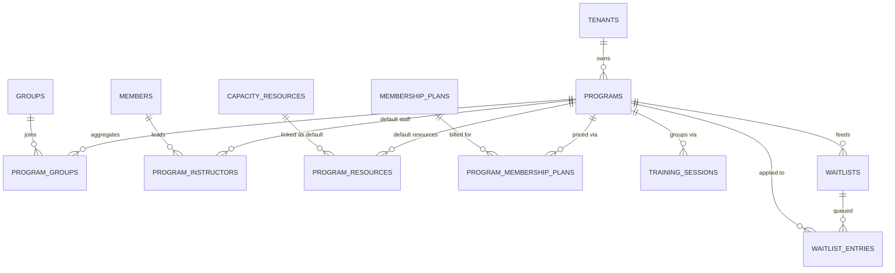

# Programma's-fundament — onderzoek & gefaseerd plan

> **Status:** research/planning-deliverable voor Task #93. Geen schema-, route- of code-wijzigingen in deze taak.
> **Scope:** introductie van een **programs**-laag als centrale planning-eenheid bovenop de bestaande
> `groups` / `training_sessions` / `instructor_*` / `capacity_resources` / `waitlists`-stack.
> **Uitgangspunten:** generiek (geen sector-specifieke tabellen), additief (alle program-FK's nullable
> tot tenants migreren), terminology-driven labels, Houtrust mag niet stuk.

---

## TL;DR — vier dingen om te onthouden

1. **Programs zijn een planning-laag, geen rename.** `groups` blijft de feitelijke deelnemers­bucket, `training_sessions` blijft het concrete event. Programs hangen er als optionele parent overheen die defaults levert (capaciteit, instructeurs, resources, marketplace-zichtbaarheid). Bij `program_id IS NULL` blijft alle huidige UI/RLS/cron-gedrag identiek — Houtrust hoeft géén program aan te maken.
2. **Programs ↔ membership_plans blijven gescheiden.** `membership_plans` is puur een billing-object; we voegen een optionele many-to-many `program_membership_plans` toe zodat een program meerdere prijspunten kan voeren (bv. proefles vs jaarpakket) zonder de billing-stack te raken.
3. **Layered defaults i.p.v. duplicatie.** Capaciteit, min-instructors en resource-bindingen worden gelezen volgens een vaste cascade `session.override → group.default → program.default`. Voor instructeurs breiden we de bestaande `session_instructors_effective`-view (Sprint 57) uit met een derde fallback-laag die naar `program_instructors` kijkt — geen duplicatie van de coalesce-logica in de app-laag.
4. **Notificatie + audit volgen het bestaande Sprint 41/43/53/55/57-patroon.** Alle nieuwe `program.*`-sources worden aan dezelfde partial unique index toegevoegd (drop+recreate, predicate spiegelen in `create_notification_with_recipients`). Audit-keys zijn voorgekookt zodat Sprint 60 zonder design-debat aan de bouwtafel begint.

---

## 1. Huidige-staat-analyse — wat hebben we, wat ontbreekt

### 1.1 Bestaande bouwstenen die programs kan oogsten

| Domein | Tabel / view | Wat het levert | Gebruik door programs |
|---|---|---|---|
| Lesgroep | `groups (max_members, max_athletes, default_min_instructors, updated_at)` + `enforce_group_max_members` trigger | Concrete deelnemersbak met harde caps en advisory-lock | Een program aggregeert 1..N groups via `program_groups` join (zie §3). Caps blijven op groep-niveau geldig. |
| Sessie | `training_sessions (group_id, starts_at, ends_at, status, location, min_instructors)` | Concreet event in de tijd | Krijgt nullable `program_id` voor analytics + instructor-fallback; geen verplichte koppeling. |
| Instructeurs | `instructor_availability` (btree_gist exclude), `instructor_unavailability`, `session_instructors`, view `session_instructors_effective` (fallback naar group-trainers, security_invoker), RPC `detect_instructor_conflicts` (4 conflict_kinds) | Wekelijkse beschikbaarheid + sessie-toewijzing met conflict-detectie | View krijgt **derde fallback-laag**: `session_instructors → group trainers → program_instructors`. Geen schema-wijziging op `session_instructors`; alleen view + RPC krijgen extra branch. |
| Resources | `capacity_resources` (self-join boom), `session_resources` met btree_gist exclude `(resource_id, tstzrange[)` overlap-protectie + sync-triggers (Sprint 55) | Tenant-scoped resource-tree met dubbel-boeking-protectie | Nieuwe join `program_resources` levert defaults; sessie-creatie kopieert ze naar `session_resources` zodat de exclusion-constraint blijft beschermen. |
| Wachtlijst | `waitlists (group_id null)`, `waitlist_entries (status, source, registration_target)`, `waitlist_offers (decision_token, expires_at, ...)` | Per-groep wachtrij met token-flow | `waitlists.group_id` blijft, we voegen optionele `waitlists.program_id` toe en `waitlist_entries.program_id` zodat een aanvraag eerst op een program landt en pas bij offer aan een groep gehangen wordt. |
| Intake-routing | `tenants.settings_json -> intake_default` + optioneel `intake_overrides_by_target` | Tenant-default registration↔waitlist | Uitbreiding met `intake_overrides_by_program` (Sprint 64), zodat een populair program op waitlist kan terwijl de rest van de tenant op registration blijft. |
| Terminology | `program_singular` / `program_plural` keys (Sprint 36), `capacity_resource_*`/`waitlist_*`/`makeup_*` keys (Sprint 47) | Resolver met override-pad | Uitbreiden met marketplace-keys + program-detail-keys (zie §3.6). Geen nieuwe resolver-laag. |
| Audit + dedup | `notifications.source` partial unique index (Sprint 41/43/53/55/57), `create_notification_with_recipients`-RPC | Idempotente notificatie-pipeline | Nieuwe `program.*`-sources volgen exact het drop+recreate-patroon. |

### 1.2 Wat er vandaag **niet** is en programs nodig heeft

1. **Geen overkoepelende planning-eenheid.** Een tenant met 8 groepen + 12 wekelijkse sessies kan vandaag niet zeggen *"deze 4 groepen vormen samen het Hardlooptraining-programma met een vaste prijslijst, vaste hoofdinstructeur en standaard 2 banen in het zwembad"*. Defaults moeten bij elke groep en elke sessie opnieuw worden ingevoerd.
2. **Geen publieke marketplace-pagina.** `submitMembershipRegistration` (`actions/public/registrations.ts`) accepteert wel een `registration_target`-tekstveld, maar er is geen bladerbare publieke lijst van wat een tenant aanbiedt. Een prospect kan vandaag niet zien *welke* lespakketten er zijn — alleen het tenant-homepage-CTA "Aanmelden".
3. **Geen koppeling tussen instructeur en aanbod.** `member_roles.role='trainer'` en `tenant_roles.is_trainer_role=true` zeggen *of* iemand instructeur is, niet *waar* die persoon hoofdinstructeur van is. Bij sessie-creatie moet dat steeds handmatig.
4. **Wachtlijst is per groep, niet per aanbod.** Dat dwingt tenants om voor elke variant van een program een aparte groep aan te maken voordat ze een wachtlijst kunnen openen — terwijl de groep nog niet eens bestaat als ze nog wachten op deelnemers.
5. **Capaciteit is op groep-niveau (`max_members`/`max_athletes`) en op sessie-niveau (`session_resources.max_participants`), maar er is geen logische default per "soort aanbod".** Een new tenant moet alle caps per groep handmatig zetten.

### 1.3 Wat er **wel** terminology-klaar is

- `program_singular` / `program_plural` (Sprint 36) wordt vandaag al gelezen door de sidebar en `/tenant/lidmaatschappen` page-titel — maar verwijst inhoudelijk naar `membership_plans`. We hergebruiken **dezelfde keys** voor de nieuwe programs-tabel zodat tenants geen tweede label-set hoeven te leren. Waar `membership_plans` nodig blijft, gebruiken we `membership_plan_singular/plural` (nieuw, zie §3.6).

### 1.4 Sector concept-mapping (generiek datamodel ↔ per-sector labels)

Het `programs`-concept is **DB-side volledig generiek** — alleen labels en seed-voorbeelden verschillen per sector. Sector-template seeds (Sprint 60) clonen passende terminology + (optioneel) example-programs naar nieuwe tenants.

| Aspect | football_school | swimming_school | generic |
|---|---|---|---|
| Label `program_singular` | Lidmaatschap | Lespakket | Programma |
| Label `program_plural` | Lidmaatschappen | Lespakketten | Programma's |
| Label `marketplace_title` | Ons aanbod | Onze lespakketten | Ons aanbod |
| Voorbeeld-programs | "Selectie U13", "Recreatief U10", "Keepersacademie" | "Watergewenning", "Diploma A", "Diploma B", "Banenzwemmen" | "Cursus voorjaar 2026", "Open trainingsuur" |
| Gerelateerde `capacity_resource.kind` | `field`, `court` | `lane`, `area` (bad → baan via `parent_id`) | `room`, `area`, `other` |
| Default-instructeur-rol-label | Hoofdtrainer | Hoofdinstructeur | Hoofdbegeleider |
| Default `capacity_purpose` | `regular` | `regular`, `makeup`, `trial` | `regular` |
| Marketplace-CTA | "Word lid" | "Schrijf in voor proefles" | "Aanmelden" |

Het datamodel kent geen sector-kolom op `programs` — sector wordt impliciet bepaald door `tenants.sector_template_key`. Alleen de seed-template-defaults verschillen.

---

## 2. Probleemstelling & ontwerp-doelen

| Doel | Acceptatie |
|---|---|
| **D1.** Tenant-admin kan een program definiëren met defaults (capaciteit, flex-capaciteit, capacity-purpose-defaults, min-instructeurs, resources, hoofdinstructeur, marketplace-zichtbaarheid, optioneel gekoppelde membership_plans). | CRUD-screen onder `/tenant/programmas`, server-actions met `assertTenantAccess` + Zod, audit-keys `program.{created,updated,published,archived}`. |
| **D2.** Bestaande groups en training_sessions kunnen optioneel aan een program hangen, met identiek gedrag bij `program_id IS NULL`. | Nieuwe FK's nullable + RLS ongewijzigd; UI toont program-badge alleen als gekoppeld; cron / dedup / e-mail-templates blijven werken. |
| **D3.** Layered defaults zonder code-duplicatie. | Eén lees-helper `getEffectiveSessionConstraints(sessionId)` in `lib/db/sessions.ts` die de cascade implementeert; view `session_instructors_effective` krijgt program-fallback inline. |
| **D4.** Publieke marketplace op route `/t/[slug]/programmas` + detail `/t/[slug]/programmas/[publicSlug]` (label uit `terminology.program_plural`) toont alle programs met `visibility='public'` en deeplinkt naar het bestaande aanmeld-formulier (`?program=<publicSlug>`). | Server-rendered, indexeerbaar, respecteert `programs.visibility='public'` én aanwezigheid van `public_slug`. `internal` = alleen voor ingelogde tenant-admins; `archived` = nergens zichtbaar (alleen historische data-retentie). De pagina **rendert ook met een lege state wanneer een tenant 0 publieke programs heeft** (terminology-driven heading + intro + CTA-card "Neem contact op") — dus geen 404 voor Houtrust; alléén individuele detail-paths `/programmas/[publicSlug]` retourneren 404 als de slug niet bestaat. Zo blijft de URL in sitemap/links bruikbaar zodra een tenant zijn eerste program publiceert. |
| **D5.** Wachtlijst kan op program-niveau worden geopend (i.p.v. alleen per groep), inclusief intake-routing override per program. | `waitlists.program_id`, `waitlist_entries.program_id` nullable; `submitMembershipRegistration` leest `intake_overrides_by_program[program.slug]` voor route-keuze. |
| **D6.** Houtrust-veiligheid. | Geen verplichte program_id ergens; backfill in geen enkele migratie raakt Houtrust-data; alle nieuwe RLS via `has_tenant_access`; dedup-index breidt het predicate uit i.p.v. herstructureren. |
| **D7.** Voorbereiding op Smart Waitlist & Placement (Task TBD). | Programs worden de "matchbare aanbod-eenheid": placement-RPC krijgt `program_id`-input, leest preferences, scoort tegen actieve groups + capaciteit. Schema in deze taak is daar al op afgesteld (zie §6 risico-paragraaf "Wat we expliciet alvast vrijhouden"). |

---

## 3. Voorgestelde architectuur

### 3.1 ER-diagram (mermaid)



### 3.2 Nieuwe tabellen (Sprint 60-61, alle FK's nullable waar mogelijk)

```text
public.programs                     -- de planning-eenheid
  id              uuid pk default gen_random_uuid()
  tenant_id       uuid not null references tenants(id) on delete cascade
  slug            text not null                              -- intern; uniek per tenant
  public_slug     text                                       -- publieke URL-slug (uniek per tenant, alleen gevuld als visibility='public')
  name            text not null                              -- intern admin-label
  marketing_title       text                                 -- publieke titel op marketplace (fallback: name)
  marketing_description text                                 -- publieke korte omschrijving (markdown/tiptap)
  hero_image_url        text                                 -- absolute URL naar App Storage object
  cta_label             text                                 -- "Word lid" / "Schrijf in voor proefles" / "Aanmelden"
  visibility      text not null default 'internal'           -- public | internal | archived
                  check (visibility in ('public','internal','archived'))
  -- 'public'   = zichtbaar op /t/<slug>/programmas marketplace + indexeerbaar
  -- 'internal' = alleen tenant-admin/staff zien het in /tenant/programmas
  -- 'archived' = historie; nergens UI-getoond, niet selecteerbaar bij sessie-creatie
  -- gelaagde defaults (worden door cascade-helper gelezen)
  default_capacity              int  check (default_capacity is null or default_capacity > 0)
  default_flex_capacity         int  check (default_flex_capacity is null or default_flex_capacity >= 0)
                                              -- buffer bovenop default_capacity (proefles, inhaal, intake)
  default_min_instructors       int  not null default 1 check (default_min_instructors >= 0)
  capacity_purpose_defaults_json jsonb not null default '{}'::jsonb
                                              -- bv. {"regular":12,"makeup":2,"trial":1} — wordt
                                              -- door capacity-overview-view gelezen voor groen/oranje/rood
  age_min          int  check (age_min is null or age_min >= 0)
  age_max          int  check (age_max is null or age_max >= age_min)
  highlights_json  jsonb not null default '[]'::jsonb        -- ["small groups","ervaren coach",...]
  -- ordering
  sort_order       int  not null default 0
  created_at, updated_at timestamptz                         -- handle_updated_at-trigger
  unique (tenant_id, slug)
  unique (tenant_id, public_slug)                            -- alleen relevant wanneer public_slug gevuld
  check (visibility <> 'public' or public_slug is not null)  -- public-zichtbaarheid vereist public_slug

public.program_groups               -- many-to-many program ↔ group
  program_id  uuid not null references programs(id) on delete cascade
  group_id    uuid not null references groups(id)   on delete cascade
  tenant_id   uuid not null                                  -- gedenormaliseerd voor RLS-snelheid
  is_primary  boolean not null default false                 -- of dit de "hoofdgroep" van het program is (UI-hint)
  sort_order  int not null default 0
  created_at  timestamptz not null default now()
  primary key (program_id, group_id)

public.program_instructors          -- default staff per program (los van session_instructors)
  program_id uuid not null references programs(id) on delete cascade
  member_id  uuid not null references members(id)  on delete cascade
  tenant_id  uuid not null
  role       text not null default 'lead'
             check (role in ('lead','assistant','substitute'))
  sort_order int not null default 0
  primary key (program_id, member_id, role)

public.program_resources            -- default resources die bij sessie-creatie worden gekopieerd
  program_id  uuid not null references programs(id) on delete cascade
  resource_id uuid not null references capacity_resources(id) on delete restrict
  tenant_id   uuid not null
  max_participants int check (max_participants is null or max_participants > 0)
  sort_order  int not null default 0
  primary key (program_id, resource_id)

public.program_membership_plans     -- optioneel gekoppelde billing-plannen (m-n)
  program_id        uuid not null references programs(id) on delete cascade
  membership_plan_id uuid not null references membership_plans(id) on delete restrict
  tenant_id         uuid not null
  is_default        boolean not null default false           -- één default per program (partial unique index)
  sort_order        int not null default 0
  primary key (program_id, membership_plan_id)
-- partial unique index program_membership_plans_one_default_uq
--   on (program_id) where is_default = true
```

### 3.3 Aanpassingen bestaande tabellen (additief, nullable)

```text
public.groups
  + program_id uuid null references programs(id) on delete set null    -- "hoort bij" hint, niet exclusief
  -- groep kan ook in program_groups m-n staan; program_id is de "primaire" als gezet

public.training_sessions
  + program_id uuid null references programs(id) on delete set null    -- analytics + instructor-fallback

public.waitlists
  + program_id uuid null references programs(id) on delete set null    -- waitlist hangt aan program OF group

public.waitlist_entries
  + program_id uuid null references programs(id) on delete set null    -- aanvraag landt op program voor offer

public.session_instructors_effective (view)
  herschreven met derde fallback-laag (zie §3.4)

public.tenants.settings_json
  + intake_overrides_by_program jsonb  (key = program slug, value in {'registration','waitlist'})
```

Indexen: `programs_tenant_visibility_idx (tenant_id, visibility, sort_order)`, `programs_marketplace_idx (tenant_id, public_slug) where visibility='public'`, `program_groups_group_idx (group_id)`, `program_instructors_member_idx (member_id)`, `training_sessions_program_idx (program_id, starts_at)` (partial `where program_id is not null`), idem voor waitlists.

### 3.4 Layered cascade — leeshelpers

**Capaciteit** (`getEffectiveCapacity(sessionId) → number | null`):
```
session_resources.max_participants (sum over resources for that session)
  ?? group.max_members
  ?? group.max_athletes        -- alleen voor athlete-rol-counts
  ?? program.default_capacity
  ?? null                       -- onbeperkt
```

**Min-instructors** (`getEffectiveMinInstructors(sessionId) → int`):
```
training_sessions.min_instructors
  ?? group.default_min_instructors
  ?? program.default_min_instructors
  ?? 1                          -- harde bodem
```

**Effective instructors** (view-uitbreiding op `session_instructors_effective`):
```sql
-- Sprint 57-versie heeft twee branches: session_instructors → group trainers.
-- "group trainer" = lid van group_members met óf member_roles.role='trainer'
-- óf een tenant_member_roles-rij naar een tenant_roles-rij met is_trainer_role=true.
-- Sprint 61 voegt een derde branch toe (program_instructors), die alleen
-- mag vuren wanneer GEEN van de twee bovenstaande branches een rij oplevert.
-- Belangrijk: het `not exists` voor group-trainers MOET beide rolbronnen
-- respecteren, anders valt een sessie ten onrechte naar program_default
-- terwijl er wel een geldige tenant-role-trainer in de groep zit.

union all
select s.id as session_id,
       pi.member_id,
       'program_default'::text as source,
       coalesce(pi.role, 'lead') as assignment_type
  from training_sessions s
  join programs p             on p.id = s.program_id
  join program_instructors pi on pi.program_id = p.id and pi.role = 'lead'
 where s.program_id is not null
   and not exists (select 1 from session_instructors si where si.session_id = s.id)
   and not exists (
     -- exact dezelfde join-set als de group-trainer-branch in de Sprint 57-view
     select 1
       from group_members gm
       left join member_roles mr
              on mr.member_id = gm.member_id and mr.role = 'trainer'
       left join tenant_member_roles tmr
              on tmr.member_id = gm.member_id
       left join tenant_roles tr
              on tr.id = tmr.tenant_role_id and tr.is_trainer_role = true
      where gm.group_id = s.group_id
        and (mr.member_id is not null or tr.id is not null)
   );
```

`detect_instructor_conflicts` (Sprint 57/59) gebruikt vandaag
`coalesce(s.min_instructors, g.default_min_instructors, 1)` voor de
understaffed-check. Sprint 61 **moet die RPC herschrijven** zodat
`programs.default_min_instructors` als derde laag wordt meegenomen:
`coalesce(s.min_instructors, g.default_min_instructors, p.default_min_instructors, 1)`,
met een `left join programs p on p.id = s.program_id`. Zonder deze rewrite
divergeren UI-helper (`getEffectiveMinInstructors`) en RPC-conflictdetectie.

**Default resources bij sessie-creatie** (server-action, niet trigger): bij insert in `training_sessions` met een `program_id` kopieert `actions/tenant/sessions.ts` rij-voor-rij `program_resources` → `session_resources`. Reden: de bestaande `session_resources` btree_gist exclusion-constraint (Sprint 55) checkt automatisch dubbel-boeking; we hoeven niets nieuws te bouwen.

### 3.5 RLS-pattern + tenant-integriteit

**Tenant-RLS** op alle nieuwe tabellen:
```sql
alter table public.programs enable row level security;
drop policy if exists "programs_tenant_all" on public.programs;
create policy "programs_tenant_all" on public.programs
  for all using (public.has_tenant_access(tenant_id))
          with check (public.has_tenant_access(tenant_id));
```

**Publieke marketplace-leestoegang.** RLS filtert *niet* op tenant — de
policy laat anonieme reads toe op alle tenants die een gepubliceerd
program hebben. De **tenant-scoping moet daarom in de query-laag**
expliciet gebeuren (route resolveert tenant via `getTenantBySlug` en
voegt `where programs.tenant_id = $resolvedTenantId` toe). Dat patroon
is identiek aan hoe de bestaande `/t/[slug]/*`-routes met `news`/
`registrations` werken.
```sql
drop policy if exists "programs_public_read" on public.programs;
create policy "programs_public_read" on public.programs
  for select to anon, authenticated
  using (visibility = 'public' and public_slug is not null);
```

**`visibility='internal'`** krijgt geen extra public-policy — die rijen
zijn uitsluitend bereikbaar via de tenant-scoped `programs_tenant_all`
policy en dus alleen voor ingelogde tenant-admin/staff. **`archived`**
komt nergens in publieke of member-screens, alleen in een
admin-only "Archief"-filter. Een dedicated `members_only`-zichtbaarheid
is **expliciet out-of-scope** voor Sprint 60-64 — komt eventueel in een
latere sprint terug zodra member-only program-routes ontstaan (eventueel onder `/tenant/aanbod-voor-leden` o.i.d. — niet nu).

**Tenant-consistency op join-tabellen.** Iedere join-tabel met
gedenormaliseerde `tenant_id` (`program_groups`, `program_instructors`,
`program_resources`, `program_membership_plans`) moet voorkomen dat een
buggy/service-role write een program uit tenant A koppelt aan een
group/member/resource uit tenant B. We doen dat met **composite
foreign keys**:
```sql
-- voorbeeld voor program_groups; identiek patroon voor de andere drie tabellen
alter table public.programs add constraint programs_id_tenant_uq unique (id, tenant_id);
alter table public.groups   add constraint groups_id_tenant_uq   unique (id, tenant_id);

alter table public.program_groups
  add constraint program_groups_program_tenant_fk
    foreign key (program_id, tenant_id) references public.programs (id, tenant_id) on delete cascade,
  add constraint program_groups_group_tenant_fk
    foreign key (group_id,   tenant_id) references public.groups   (id, tenant_id) on delete cascade;
```
`(id, tenant_id)`-uniques bestaan vandaag nog niet op `programs` /
`groups` / `members` / `capacity_resources` / `membership_plans` — Sprint
60 voegt ze allemaal idempotent toe. De composite FK garandeert
schema-niveau dat `program_groups.tenant_id` exact gelijk is aan zowel
`programs.tenant_id` als `groups.tenant_id`. Dezelfde aanpak voor de
overige drie join-tabellen (members, capacity_resources, membership_plans).

Voor `program_groups` / `program_instructors` / `program_resources` /
`program_membership_plans` alleen de `_tenant_all`-policy (geen publieke
read). Publieke route leest alléén uit `programs` zelf en hydrateert
losse data via tenant-gescopede service-role-queries.

### 3.6b Bewuste afwijking: geen aparte `program_sessions`-koppeltabel

Task #93 stap 4 noemt expliciet een `program_sessions`-relatie-tabel. Dit voorstel kiest bewust voor **directe nullable FK `training_sessions.program_id`** in plaats van een dedicated join-tabel, om de volgende redenen:

1. **Cardinaliteit is 1-N, niet N-N.** Een sessie hoort altijd bij hooguit één programma (zoals ze nu ook hooguit bij één groep horen). Een join-tabel modelleert N-N en zou hier alleen een lege laag toevoegen.
2. **Cascade leest sneller.** `getEffectiveCapacity` en `session_instructors_effective` doen één extra `left join programs p on p.id = s.program_id`. Een join-tabel zou dat een extra hop maken zonder semantische winst.
3. **Houtrust-veiligheid identiek.** De FK is nullable + indexed; een join-tabel met 0 rijen geeft exact dezelfde regressie-garantie maar voegt onderhoud toe (RLS-policy, tenant-FK, dedup-rules).
4. **N-N-koppeling tussen programma's en groepen blijft wél een join-tabel** (`program_groups`), omdat dáár wél meerdere programma's één groep kunnen delen (bijv. één "selectie A1"-groep die zowel "Voorjaars-clinic" als "ABC-traject" voedt).

Conclusie: de geest van stap 4 (programma ↔ sessie koppelen zonder bestaand sessie-schema te breken) is gehonoreerd; de letterlijke `program_sessions`-tabel is vervangen door een goedkoper en cardinaliteit-correct alternatief. Mocht een latere sprint expliciet N-N nodig krijgen (sessie deelbaar tussen meerdere programma's), dan kan `program_sessions` alsnog additief worden toegevoegd.

### 3.7 Data model classification matrix

Onderstaande matrix vat alle voorgestelde wijzigingen samen volgens de in Task #93 stap 4 gevraagde labels: **new table** / **new column** / **migration** (data-aanpassing of constraint) / **view** / **UI-only** / **later phase** (pas na Sprint 60-64).

| Item | Type | Sprint | Houtrust-impact |
|---|---|---|---|
| `programs` (tabel) | new table | 60 | none (leeg voor Houtrust) |
| `program_groups` (tabel + composite FK's) | new table | 60 | none |
| `groups.program_id` (kolom, nullable) | new column | 60 | none — blijft NULL |
| `(id, tenant_id)`-unique op `programs`/`groups` | migration | 60 | additief, idempotent |
| Trigger `enforce_group_primary_program` | migration | 60 | none (vuurt alleen bij `program_groups`-writes) |
| Permission-keys `programs.*` | migration (catalog-row) | 60 | none |
| Terminology-keys (§3.6) | migration (jsonb-merge sector_templates) | 60 | additief |
| `/tenant/programmas` lijst + nieuw + detail (overzicht/groepen tabs) | UI-only | 60 | none |
| `program_instructors` (tabel + composite FK) | new table | 61 | none |
| `program_resources` (tabel + composite FK) | new table | 61 | none |
| `(id, tenant_id)`-unique op `members`/`capacity_resources` | migration | 61 | additief |
| `session_instructors_effective` (rewrite) | view | 61 | snapshot-test bewijst byte-identiek voor Houtrust |
| RPC `detect_instructor_conflicts` (rewrite met `program.default_min_instructors` in coalesce) | migration | 61 | identiek voor Houtrust (geen `program_id`) |
| Cascade-helpers `getEffectiveCapacity`/`getEffectiveMinInstructors` | UI-only (server-helpers) | 61 | none — fall through naar bestaande velden |
| `training_sessions.program_id` (kolom, nullable) | new column | 61 | none |
| Sessie-creatie copy `program_resources → session_resources` | UI-only (server-action) | 61 | none — alleen als `program_id` set |
| `program_membership_plans` (tabel + partial unique index `is_default`) | new table | 62 | none |
| `program_capacity_overview` (view, security_invoker) | view | 62 | leest read-only; raakt Sprint 42 `max_members`-trigger niet |
| `/tenant/planning/capaciteit` dashboard | UI-only | 62 | toont Houtrust-data zonder programma-rij |
| `programs_public_read` policy | migration | 63 | none — Houtrust heeft geen public programs |
| `registrations.program_id` (kolom, nullable) | new column | 63 | none — blijft NULL |
| `/t/[slug]/programmas` + `/t/[slug]/programmas/[publicSlug]` | UI-only | 63 | lijst rendert lege state voor Houtrust (heading + intro + contact-CTA, geen 404); detail 404 op onbekende slug |
| `?program=<publicSlug>` deeplink in `submitMembershipRegistration` | UI-only (server-action) | 63 | none — backwards compatible |
| `waitlists.program_id`, `waitlist_entries.program_id` (kolommen, nullable) | new column | 64 | none — blijven NULL |
| `notifications.source='waitlist_entry_program_assigned'` (dedup-index uitbreiden) | migration | 64 | drop+recreate index + spiegelen `on conflict where` |
| `tenants.settings_json.intake_overrides_by_program` (settings-key) | migration (Zod-schema-extend) | 64 | none — leeg = bestaand gedrag |
| Smart waitlist & placement (RPC + scoring) | later phase | n.v.t. | aparte taak post-Sprint 64 |
| Drag-drop placement canvas, bulk-import, copy-to-tenant | later phase | n.v.t. | expliciet out-of-scope (§6.3) |

### 3.6 Terminology-uitbreidingen (Sprint 60)

Hergebruik `program_singular`/`program_plural` (al bestaand). Nieuwe keys:

| Key | football_school | swimming_school | generic |
|---|---|---|---|
| `programs_page_description` | Beheer aanbod, prijzen en publieke zichtbaarheid van uw lidmaatschappen. | Beheer lespakketten, prijzen en zichtbaarheid op uw publieke pagina. | Beheer programma's en publieke zichtbaarheid. |
| `programs_marketplace_title` | Ons aanbod | Onze lespakketten | Ons aanbod |
| `programs_marketplace_intro` | Bekijk welke lidmaatschappen wij aanbieden. | Bekijk welke lespakketten wij aanbieden. | Bekijk ons volledige aanbod. |
| `programs_new_button` | Nieuw lidmaatschap | Nieuw lespakket | Nieuw programma |
| `program_assignment_lead_label` | Hoofdtrainer | Hoofdinstructeur | Hoofdbegeleider |
| `membership_plan_singular` / `_plural` | Tarief / Tarieven | Prijsplan / Prijsplannen | Plan / Plannen |

`membership_plan_*` ontkoppelt billing-labels van program-labels (anders ontstaat verwarring zodra een program meerdere plannen heeft).

---

## 4. UX-blueprint

### 4.1 Tenant-admin

- **`/tenant/programmas`** — lijst-view (sortable: naam, visibility, # groepen, # actieve sessies). Filters: visibility (public/internal/archived), gekoppeld aan groep. CTA "Nieuw <program_singular>".
- **`/tenant/programmas/[id]`** — detail met 5 tabs (`?tab=`):
  1. **Overzicht** — naam, interne slug, `visibility`-segmented-control (public/internal/archived). Wanneer `visibility=public` worden marketplace-velden actief: `public_slug`, `marketing_title`, `marketing_description` (TipTap), `hero_image_url` (App Storage upload), `cta_label`. Live-preview van marketplace-card.
  2. **Groepen** — tabel `program_groups` met add/remove, `is_primary`-flag, sort-order drag-handle.
  3. **Capaciteit & defaults** — formulier voor `default_capacity`, `default_flex_capacity`, `capacity_purpose_defaults_json` (key/value rows: regular/makeup/trial/…), `default_min_instructors`, ouderdomsbereik, highlights (chip-input).
  4. **Instructeurs** — `program_instructors` editor (lead/assistant/substitute), member-picker beperkt tot trainers (via beide rolbronnen, conform Sprint 57-helper `assertMemberHasTrainerRole`).
  5. **Resources & prijzen** — twee subsecties: `program_resources` koppel-list met inline `max_participants`-editor, en `program_membership_plans` met `is_default`-radio.
- **Op groep-detail** verschijnt een nieuwe sectie "Onderdeel van" die alle programs toont waaraan deze groep hangt (zowel via `groups.program_id` als via `program_groups`). Geen wijziging in bestaande tabs.
- **Op sessie-detail** verschijnt program-badge naast group-badge wanneer `program_id` is gezet. De bestaande "Capaciteit"-pill leest nu uit `getEffectiveCapacity` met tooltip die de bron toont (`session-override`/`group-default`/`program-default`).

### 4.2 Publieke marketplace (Sprint 63)

Routes volgen exact de spec in Task #93 stap 6:

- **`/t/[slug]/programmas`** — server-rendered grid van marketplace-cards (`marketing_title` met fallback naar `name`, `marketing_description`, `hero_image_url`, age-range, highlights, CTA-label uit `cta_label` met fallback naar terminology). Pagina-titel uit `terminology.program_plural`, intro uit `terminology.programs_marketplace_intro`. **Lege state**: wanneer er geen public programs zijn (Houtrust-scenario) rendert de pagina alsnog netjes met heading + intro + één CTA-card "Neem contact op met de organisatie" die linkt naar `/t/[slug]/contact` (of, als die niet bestaat, de generieke `/t/[slug]/inschrijven`-flow). Geen 404. Detail-paths `/programmas/[publicSlug]` retourneren wél 404 voor onbekende slugs.
- **`/t/[slug]/programmas/[publicSlug]`** — detail-pagina met TipTap-render van `marketing_description`, gekoppelde groepen (publiek-veilige metadata: naam, dagdelen uit `training_sessions` aggregaat), highlights, "Direct aanmelden"-CTA die naar `/t/[slug]/aanmelden?program=<publicSlug>` linkt.
- **`/t/[slug]/aanmelden?program=<publicSlug>`** — bestaande registratie-wizard krijgt een optionele `?program=`-query. `submitMembershipRegistration` resolveert het program (per `(tenant_id, public_slug)`), schrijft `registrations.program_id` (nieuwe nullable kolom in Sprint 63) en bepaalt intake-route via `intake_overrides_by_program` (Sprint 64) → `intake_overrides_by_target` → `intake_default`.

### 4.3 Member/parent-shell

Geen nieuwe screens in MVP. Sprint 64 voegt op `/me` een sectie "Wachtlijst-aanvragen" toe die `waitlist_entries` toont met program-naam.

---

## 5. Permissions & audit

### 5.1 Permission-keys (in `lib/permissions/catalog.ts`)

| Key | Default rol-toewijzing |
|---|---|
| `programs.read` | tenant_admin, staff (+ trainer voor "leesbaar in eigen agenda") |
| `programs.write` | tenant_admin |
| `programs.publish` | tenant_admin (vereist voor `visibility=public` toggle) |
| `programs.assign_instructors` | tenant_admin |
| `programs.manage_resources` | tenant_admin |
| `programs.manage_capacity` | tenant_admin |
| `programs.override_capacity` | tenant_admin (sessie/group override boven program-default) |
| `programs.link_membership_plan` | tenant_admin |
| `programs.view_capacity_dashboard` | tenant_admin, staff |

### 5.1b Volledige rol × actie-matrix

✅ = mag, 🚫 = mag niet, 👁 = read-only.

| Actie ↓ / Rol → | platform-admin | tenant-admin | examiner | trainer | member | ouder | public |
|---|:-:|:-:|:-:|:-:|:-:|:-:|:-:|
| Manage programs (CRUD) | ✅ (alle tenants) | ✅ | 🚫 | 🚫 | 🚫 | 🚫 | 🚫 |
| Publish program (`visibility=public` toggle) | ✅ | ✅ | 🚫 | 🚫 | 🚫 | 🚫 | 🚫 |
| Manage capacity defaults op program | ✅ | ✅ | 🚫 | 🚫 | 🚫 | 🚫 | 🚫 |
| Override capacity op group/session | ✅ | ✅ | 🚫 | 👁 (eigen sessies) | 🚫 | 🚫 | 🚫 |
| Assign program instructors (defaults) | ✅ | ✅ | 🚫 | 🚫 | 🚫 | 🚫 | 🚫 |
| Manage program resources (defaults) | ✅ | ✅ | 🚫 | 🚫 | 🚫 | 🚫 | 🚫 |
| View capacity dashboard `/tenant/planning/capaciteit` | ✅ | ✅ | 🚫 | 👁 (eigen sessies/groepen) | 🚫 | 🚫 | 🚫 |
| Register-via-marketplace `/t/<slug>/programmas/<publicSlug>` → `/aanmelden?program=` | ✅ | ✅ | ✅ | ✅ | ✅ | ✅ | ✅ (anon) |
| Lees publieke program-details (`visibility=public`) | ✅ | ✅ | ✅ | ✅ | ✅ | ✅ | ✅ |
| Lees `internal` programs | ✅ | ✅ | 🚫 | 👁 (alleen waar trainer-koppeling) | 🚫 | 🚫 | 🚫 |
| Lees `archived` programs | ✅ | ✅ (Archief-filter) | 🚫 | 🚫 | 🚫 | 🚫 | 🚫 |
| Beheer `intake_overrides_by_program` (`tenants.settings_json`) | ✅ | ✅ | 🚫 | 🚫 | 🚫 | 🚫 | 🚫 |

Helpers: `assertTenantAccess`, `isPlatformAdmin`, `isTenantAdmin` (bestaand), `assertMemberHasTrainerRole` (Sprint 57). Trainer "lees eigen sessies" gebruikt de bestaande `/t/<slug>/agenda` filter via `member_id`.

### 5.2 Audit-namespace (in `lib/audit/actions.ts`)

```
program.created
program.updated
program.published          -- specifiek: visibility flip naar 'public' (vereist public_slug)
program.archived           -- specifiek: visibility flip naar 'archived'
program.group.linked
program.group.unlinked
program.instructor.assigned
program.instructor.removed
program.resource.linked
program.resource.unlinked
program.membership_plan.linked
program.membership_plan.unlinked
program.capacity.updated
program.marketplace.updated   -- visibility/hero/highlights
program.intake_override.set
```

### 5.3 Notification dedup (Sprint 41/43/53/55/57-patroon)

Sprint 60 voegt geen notification-sources toe. Sprint 64 (waitlist-koppeling) voegt `waitlist_entry_program_assigned` toe — index drop+recreate met nieuwe key in `where`-predicate, identiek predicate in `create_notification_with_recipients`-`on conflict ... where`-clause. `source_ref = waitlist_entries.id` (uniek-per-event, conform Sprint 41/43-Gotcha — nooit `program_id` of `group_id`).

---

## 6. Risico's, mitigaties & out-of-scope

### 6.1 Risico's en mitigaties

| Risico | Mitigatie |
|---|---|
| **R1.** Verwarring tussen `programs` (planning) en `membership_plans` (billing) — tenants denken dat ze hun lidmaatschappen "moeten migreren". | Eén label-set (`program_*` voor planning, `membership_plan_*` voor billing). Onboarding-tour bij eerste bezoek aan `/tenant/programmas` legt de relatie uit. Migration-pad is opt-in via Sprint 63 wizard "Maak program van bestaand lidmaatschap". |
| **R2.** Dubbele waarheid voor "groep hoort bij program" — `groups.program_id` én `program_groups`. | `groups.program_id` is de "primary"-hint en wordt bij elke `program_groups`-insert/delete gesynct via een DB-trigger (`enforce_group_primary_program`). UI toont alleen `program_groups`. Documenteren dat `groups.program_id` puur een denormalized read-helper is. |
| **R3.** Cascade-helper performance bij sessie-pagina's met veel sessies. | View-fallback in DB (`session_instructors_effective`) regelt instructeurs zonder N+1. Capaciteit/min-instructors lezen we per sessie inline — bij lijst-views aggregeren via een SQL-join, niet per-rij. |
| **R4.** Marketplace-pagina lekt programs van andere tenants. | `programs_public_read` policy filtert **niet** op tenant — die laat anonieme reads toe op alle gepubliceerde programs ongeacht tenant. Tenant-scoping gebeurt **expliciet in de query-laag**: route resolveert tenant via `getTenantBySlug` en bouwt elke select met `where tenant_id = $resolvedTenantId`. Test (Sprint 63 RLS-test) verifieert dat een query zonder tenant-filter vanaf anonymous client meerdere tenants kan lezen — wat juist bewijst dat de query-laag verantwoordelijk is. Identiek patroon aan bestaande `/t/[slug]/news`-routes. |
| **R5.** Houtrust-regressie door view-rewrite (Sprint 61). | View-test: snapshot output van `session_instructors_effective` voor 5 Houtrust-sessies vóór én na migratie; moet identiek zijn (voor Houtrust is `program_id IS NULL`, dus de nieuwe branch wordt niet geraakt). Opgenomen als acceptatie-criterium voor Sprint 61. |
| **R6.** Resource-defaults uit program leiden tot exclude-violation bij sessie-creatie. | App-laag vangt `23P01` (exclusion_violation) op tijdens kopie en valt terug op partial fill (alleen niet-conflicterende resources kopiëren) + waarschuwing in UI. Geen schema-noviteit — alleen error-handling-pattern. |
| **R7.** Smart-waitlist-placement gaat scope creepen in Sprint 64. | Sprint 64 doet alléén `waitlists.program_id` + `intake_overrides_by_program` + UI om aanvraag aan program te koppelen. **Geen** placement-RPC. Smart placement = aparte taak, leest dan `program_id` op `waitlist_entries` als matching-input. |

### 6.2 Wat we expliciet **alvast vrijhouden** voor smart waitlist & placement

- `waitlist_entries.program_id` (Sprint 64) is de match-key voor de toekomstige `score_waitlist_candidates(program_id)`-RPC.
- `programs.default_capacity` + `program_groups.is_primary` geven die RPC een eerste-keuze-groep om naar te placen.
- `program_membership_plans.is_default` levert de prijspunt voor automatische membership-toewijzing bij conversie.
- **Geen** column toevoegen die nu nog niet gebruikt wordt door Sprint 60-64. Smart placement krijgt zijn eigen Sprint met eigen migratie.

### 6.3 Out-of-scope voor Sprint 60-64

- Visuele drag-drop placement van members tussen groepen binnen een program.
- Automatische e-mail bij publish/unpublish van een program.
- Bulk-import van programs uit CSV.
- Copy-to-tenant bij multi-tenant beheer (platform-admin).
- Diepere koppeling met `progress_modules` of `milestone_events` (programs blijven los van progressie-stack).

---

## 7. Gefaseerd plan — Sprint 60-64

> Iedere sprint volgt het vaste werkwijze-blok uit `replit.md`: dev-DB migreren → prod-DB migreren → release notes SQL → commit-instructies → VPS pull/build. SQL-files zijn idempotent (`if not exists`, drop+create voor policies/triggers).

### Sprint 60 — Programs MVP (v0.16.0)

**Geïsoleerde waarde**: Tenant-admin kan programma's aanmaken en bestaande groepen koppelen. Geen marketplace, geen capaciteits-cascade. Tenants zonder programma's (Houtrust) zien helemaal niets nieuws — alle nieuwe FK's nullable, geen UI-zichtbare wijziging op groep-, sessie- of registratie-schermen.

**Migratie-files** (`artifacts/nxttrack/supabase/`):
1. `sprint60_programs.sql` — tabellen `programs` (met `visibility public|internal|archived`, `public_slug`, `marketing_*`-velden, `default_capacity`, `default_flex_capacity`, `default_min_instructors`, `capacity_purpose_defaults_json`), `program_groups`. Idempotente `(id, tenant_id)`-uniques op `programs` én `groups` (en, voor latere sprints, voorbereidend ook op `members`, `capacity_resources`, `membership_plans`). `program_groups` krijgt composite FK's `(program_id, tenant_id)` → `programs(id, tenant_id)` en `(group_id, tenant_id)` → `groups(id, tenant_id)` voor schema-niveau tenant-isolatie (§3.5). Trigger `enforce_group_primary_program` houdt `groups.program_id` in sync met `program_groups (is_primary=true)`. Nullable `groups.program_id`-kolom + index. Permission-keys uit §5.1 toegevoegd aan `permission_catalog`.
2. `sprint60_release_v0_16_0.sql` — release-notes-row.

**Terminology-impact** (Sprint 60): bestaande keys `program_singular`/`program_plural` worden nu inhoudelijk hergebruikt voor de nieuwe tabel. Nieuwe keys via jsonb-merge op alle drie sector-templates (`football_school`/`swimming_school`/`generic`): `programs_page_description`, `programs_marketplace_title`, `programs_marketplace_intro`, `programs_new_button`, `program_assignment_lead_label`, `membership_plan_singular`, `membership_plan_plural`. Default-waarden uit §3.6 tabel.

**App-laag**:
- `lib/db/programs.ts` — listProgramsPage, getProgramById, hydrateProgramAggregates (member_count via groups, session_count laatste 30d).
- `lib/actions/tenant/programs.ts` — createProgram, updateProgram, archiveProgram, setVisibility (mag visibility 'public' alleen wanneer `public_slug` ingevuld is), linkGroup, unlinkGroup, setPrimaryGroup. Audit + Zod + assertTenantAccess.
- UI: `/tenant/programmas` lijst + `/tenant/programmas/nieuw` form + `/tenant/programmas/[id]?tab=overzicht|groepen` (alleen 2 tabs in deze sprint).

**Niet in Sprint 60**: instructors-tab, resources-tab, membership-plans-tab, marketplace-route, capacity-cascade-helper, waitlist-koppeling, capacity-overview-view.

**Acceptatie**: Houtrust kan zonder program werken (geen UI-veranderingen op groep- of sessie-detail). Nieuwe program kan groepen koppelen, `groups.program_id` blijft synchroon met `is_primary`-rij.

### Sprint 61 — Instructors + resources defaults (v0.16.1)

**Geïsoleerde waarde**: Tenants stellen één keer hoofdinstructeur(s) en standaard-resources (banen/velden/zalen) in op program-niveau; bij iedere nieuwe sessie worden die automatisch overgenomen. Bestaande Sprint 57 instructeurs-fallback krijgt een derde laag, zonder breaking change voor tenants zonder programs.

**Migratie**:
1. `sprint61_program_defaults.sql` — `program_instructors`, `program_resources` (beide met composite `(parent_id, tenant_id)`-FK's conform §3.5; vereist `(id, tenant_id)`-uniques op `members` en `capacity_resources` die in dezelfde file idempotent worden toegevoegd als ze ontbreken). View `session_instructors_effective` herschreven met derde fallback-branch waarvan het `not exists`-predicate **beide** trainer-rolbronnen respecteert (`member_roles.role='trainer'` OR `tenant_roles.is_trainer_role=true`) — zie §3.4. RPC `detect_instructor_conflicts` herschreven zodat understaffed-check `coalesce(s.min_instructors, g.default_min_instructors, p.default_min_instructors, 1)` gebruikt (extra `left join programs p on p.id = s.program_id`). Helper-RPC `program_default_capacity(program_id) returns int` voor RLS-veilige publieke lezing.
2. `sprint61_release_v0_16_1.sql`.

**Terminology-impact** (Sprint 61): geen nieuwe keys vereist. `program_assignment_lead_label` (Sprint 60) wordt actief gebruikt op de Instructeurs-tab.

**App-laag**:
- Cascade-helpers `getEffectiveCapacity`, `getEffectiveMinInstructors` in `lib/db/sessions.ts`.
- Sessie-creatie copy: `actions/tenant/sessions.ts` doet bij insert met `program_id` automatisch `program_resources` → `session_resources`. Error-handling voor `23P01` (zie R6).
- UI: tabs Instructeurs + Resources & prijzen op program-detail. Tab `Resources & prijzen` toont alleen resources-helft in deze sprint; membership-plans-helft volgt in Sprint 62.

**Acceptatie**: Sessie-detail toont Capaciteit-tooltip met bron. View-snapshot voor Houtrust identiek voor/na.

### Sprint 62 — Layered capacity + capacity-color view + plan-link (v0.16.2)

**Geïsoleerde waarde**: Tenant-admin krijgt één capaciteits-dashboard `/tenant/planning/capaciteit` met groen/oranje/rood/blauw/grijs-statussen per programma/groep/sessie. `program_membership_plans` koppelt optioneel billing aan een program (suggestie-laag, registratie-flow blijft werken zonder).

**Migratie**:
1. `sprint62_program_capacity.sql` — `program_membership_plans` met partial unique index `program_membership_plans_one_default_uq on (program_id) where is_default=true`. **View `program_capacity_overview`** (`security_invoker=true`) die per `(tenant_id, program_id, group_id, session_id)` retourneert: `fixed_capacity` (= `coalesce(session_resources.max_participants, group.max_members, program.default_capacity)`), `flex_capacity` (= `coalesce(group.flex_buffer_override, program.default_flex_capacity, 0)`), `used_count` (uit `training_attendance` + `registrations`), `free_count`, `purpose_breakdown_json` (per `capacity_purpose`-key uit `capacity_purpose_defaults_json`). Geen kleur-kolom in DB — kleur is UI-derived in `lib/ui/capacity-color.ts` (groen ≤ 70%, oranje 71-90%, rood 91-100%, blauw > 100% binnen flex_capacity, grijs = `fixed_capacity is null`). Houtrust-veiligheid: bij `program_id IS NULL` valt `program.*` weg via `left join` en breekt de bestaande Sprint 42 `max_members`-trigger niet (view leest read-only).
2. `sprint62_release_v0_16_2.sql`.

**Terminology-impact** (Sprint 62): geen nieuwe keys. Kleur-statussen krijgen vaste labels in `capacity-color.ts` ("Genoeg plek", "Bijna vol", "Vol", "Overboekt", "Onbeperkt"). Komen later in een `capacity_status_*` keyset terug als tenants dat willen aanpassen — niet voor Sprint 62.

**App-laag**:
- Membership-plans-helft van tab "Resources & prijzen" wordt actief.
- Nieuwe route `/tenant/planning/capaciteit` met dashboard: kolommen Programma | Groepen | Komende sessies | Bezetting | Kleur. Filter op program/groep/datumbereik.
- Lijst-view `/tenant/programmas` toont kleurband per rij op basis van geaggregeerde overview.
- Sessie-creatie picker toont gekoppelde plannen wanneer program is gekozen.

**Acceptatie**: Houtrust ziet `/tenant/planning/capaciteit` met al zijn bestaande groepen op basis van `group.max_members` (= "grijs/groen"-band), zonder enige programma-rij. Nieuwe tenants met programs zien layered capaciteit kloppen voor alle 4 status-kleuren.

### Sprint 63 — Public marketplace + `?program=`-deeplink (v0.17.0)

**Geïsoleerde waarde**: Iedere tenant met `visibility=public` programs heeft een SEO-vriendelijke marketplace-pagina onder `/t/[slug]/programmas` + detail `/t/[slug]/programmas/[publicSlug]`. CTA's deeplinken naar bestaande registratie-wizard met `?program=<publicSlug>`-pre-fill, zonder bestaand registratie-gedrag te wijzigen.

**Migratie**:
1. `sprint63_programs_public.sql` — `programs_public_read` policy (`visibility='public' AND public_slug IS NOT NULL`). `registrations.program_id` nullable kolom + index. Idempotent `add column if not exists`.
2. `sprint63_release_v0_17_0.sql`.

**Terminology-impact** (Sprint 63): `programs_marketplace_title` en `programs_marketplace_intro` (Sprint 60) worden hier voor het eerst publiek gerenderd. Geen nieuwe keys.

**App-laag**:
- Routes `/t/[slug]/programmas` + `/t/[slug]/programmas/[publicSlug]`. Pagina-titel via `getTenantTerminology(tenant).program_plural`.
- `submitMembershipRegistration` leest `program` query-param, valideert per `(tenant_id, public_slug)`, schrijft `registrations.program_id`. Tenant-scoping in query-laag (§3.5, R4).
- Tenant-admin krijgt nieuwe knop "Marketplace voorbeeld" op program-detail die `?preview=1` gebruikt om ook `internal`-programs te tonen (sessie-only, met cookie-token, tenant-admin-only).

**Acceptatie**: Houtrust → `/t/houtrust/programmas` rendert met lege state (heading + intro + contact-CTA), géén 404. Tenant met 1 public program ziet card + detail correct. Een onbekende detail-slug retourneert wél 404.

### Sprint 64 — Waitlist program-koppeling + intake-overrides (v0.17.1)

**Geïsoleerde waarde**: Wachtlijsten en intake-routing kunnen op program-niveau worden gezet (i.p.v. alleen per groep). Bereidt smart-placement voor zonder zelf placement-algoritme te bouwen.

**Migratie**:
1. `sprint64_waitlist_programs.sql` — `waitlists.program_id`, `waitlist_entries.program_id` nullable + indexen. Notification dedup-index uitgebreid met `waitlist_entry_program_assigned` (drop+recreate, predicate gespiegeld in `create_notification_with_recipients`-`on conflict where`-clause; `source_ref = waitlist_entries.id` per Sprint 41/43-Gotcha). `tenants.settings_json.intake_overrides_by_program` is een settings-key (geen schema-wijziging, alleen documentatie + Zod-extend op `tenant_settings_json_schema.ts`).
2. `sprint64_release_v0_17_1.sql`.

**Terminology-impact** (Sprint 64): geen nieuwe keys. Bestaande `waitlist_*` terminology (Sprint 49) wordt hergebruikt.

**App-laag**:
- `submitMembershipRegistration` resolveert intake-route via cascade `intake_overrides_by_program[publicSlug] → intake_overrides_by_target[target] → intake_default`.
- `/tenant/wachtlijst` filter "Op program".
- `/tenant/registrations/instellingen` krijgt subpaneel "Per programma overrides" naast bestaande "Per doelgroep".
- Audit-keys `program.intake_override.set`, `program.waitlist.linked`.

---

## 8. Beslisblok — pakket-aanbeveling met tijds- en risico-inschatting

Per Task #93 stap 11 een expliciete eindaanbeveling met drie pakket-keuzes. Tijds-inschatting is in **agent-werk-dagen** (vergelijkbaar met Sprint 47-59 doorlooptijd), risico is t.o.v. Houtrust-regressie + scope-creep.

| Pakket | Inhoud | Levert | Tijd | Risico | Aanbevolen voor |
|---|---|---|---|---|---|
| **A. Alleen Sprint 60 (v0.16.0)** | Programs CRUD + program_groups + 2 tabs (Overzicht, Groepen). Geen cascade, geen marketplace. | Tenant-admin kan programma's modelleren en groepen koppelen — nuttig als demo/positionering, maar nog geen operationele winst. | 1-2 dagen | **Laag** — alleen nieuwe tabellen + 1 trigger; geen view-rewrites, geen RPC-rewrites; Houtrust ziet 0 wijzigingen in eigen flows. | Tenants die alleen organisatie-overzicht willen of die wachten op ABC-program-import voordat ze échte planning doen. |
| **B. Sprint 60 + 61 + 62 (v0.16.0 → v0.16.2) — aanbevolen MVP** | Pakket A + program-instructeurs + program-resources defaults + view-rewrite met 3e fallback + RPC-rewrite + cascade-helpers + `program_capacity_overview`-view + capaciteitsdashboard `/tenant/planning/capaciteit` + `program_membership_plans`. | **Volledig operationeel intern fundament**: tenants definiëren één keer hun programma + defaults, alle nieuwe sessies erven instructeurs, resources, capaciteit; admin ziet kleur-dashboard. Geen publieke laag, geen waitlist-koppeling. | 5-7 dagen | **Midden** — view-rewrite (`session_instructors_effective`) + RPC-rewrite (`detect_instructor_conflicts`) + capacity-view raken bestaande paden. Mitigatie: snapshot-test Sprint 61 (R5) + `program_id IS NULL`-coalesce overal. Houtrust draait identiek. | **Default-aanbeveling**: tenants die programma's vandaag al gebruiken in hun planning + zwemschool-tenants die capaciteitskleuren willen. |
| **C. Pakket B + Sprint 63 + 64 (v0.17.0 → v0.17.1) — full programma-laag** | Pakket B + publieke marketplace `/t/[slug]/programmas` + detail + `?program=`-deeplink + `registrations.program_id` + waitlist-koppeling op program-niveau + `intake_overrides_by_program`. | **Volledige programma-laag inclusief publieke marktplaats en intake-routing per programma**. Bereidt smart-waitlist-placement voor. | 9-12 dagen totaal | **Midden-hoog** — publieke RLS-policy + tenant-leak-risico (R4) + dedup-index uitbreiden (Sprint 41/43-patroon, R6). Mitigatie: expliciete RLS-test (Sprint 63), drop+recreate index met spiegeling van `on conflict where`-predicate (Sprint 64). | Tenants die actief leden werven via publieke pagina (zwemscholen, recreatieve trainingen, open cursussen) of die wachtlijsten op aanbod-niveau willen openen voordat de groepen bestaan. |

### Aanbeveling

**Begin met pakket B** (Sprint 60+61+62) als one-shot vrijgave-traject. Het levert binnen ~1 sprint week het volledige interne fundament zonder publieke afhankelijkheden. Na pakket B is het veilig om óf direct door te schuiven naar pakket C (publieke marketplace + waitlist), óf eerst smart-waitlist-placement als aparte taak op te pakken — het schema in pakket B is op beide voorbereid (zie §6.2 "wat we expliciet alvast vrijhouden"). Pakket A alleen heeft beperkte standalone waarde en wordt afgeraden tenzij er externe blokkers zijn voor verder bouwen.

---

## 8a. MVP-definitie (Sprint 60 alleen)

- Programs CRUD met velden uit §3.2 minus marketplace-velden (`marketing_title`, `marketing_description`, `hero_image_url`, `cta_label`, `public_slug`, `age_min/max`, `highlights_json` mogen leeg blijven; `visibility` mag enkel `internal` of `archived` zijn — `public` wordt pas relevant in Sprint 63).
- `program_groups` koppel-tabel met add/remove/sort/`is_primary`.
- Twee tabs: Overzicht + Groepen.
- Geen cascade-helper, geen view-rewrite, geen marketplace, geen waitlist-koppeling.
- Houtrust-regressie-check: `pnpm typecheck` + handmatige walk door `/tenant/groepen`, `/tenant/lidmaatschappen`, `/tenant/sessies`, `/t/houtrust` — alle screens identiek.

---

## 9. Risico-samenvatting (snel-referentie)

| ID | Risico | Sprint dat het adresseert |
|---|---|---|
| R1 | programs vs membership_plans verwarring | Sprint 60 (terminology + onboarding-tour) |
| R2 | dubbele waarheid groups.program_id | Sprint 60 (sync-trigger) |
| R3 | cascade-performance | Sprint 61 (view + SQL-aggregaten) |
| R4 | marketplace tenant-leak | Sprint 63 (RLS + dubbele filter) |
| R5 | view-rewrite Houtrust-regressie | Sprint 61 (snapshot-test) |
| R6 | resource-default exclude-violation | Sprint 61 (23P01 error-handling) |
| R7 | smart-placement scope creep | Sprint 64 (expliciete cut) |

---

## 10. Testing-strategie

| Laag | Wat | Wanneer |
|---|---|---|
| **Unit** | Cascade-helpers (`getEffectiveCapacity`, `getEffectiveMinInstructors`) — 8 cases per helper inclusief alle nullable-combinaties | Sprint 61 |
| **DB** | View-snapshot van `session_instructors_effective` voor Houtrust (5 sessies) vóór/na — moet byte-identiek zijn | Sprint 61, in `supabase/tests/sprint61_view_snapshot.sql` |
| **DB** | Sync-trigger `enforce_group_primary_program`: insert/update/delete-paden met assertions op `groups.program_id` | Sprint 60 |
| **RLS** | Publieke selects op `programs` — anonieme client mag alleen `visibility='public' AND public_slug IS NOT NULL` zien, en moet expliciet aantonen dat die select cross-tenant data oplevert (= bewijs dat de query-laag verantwoordelijk is voor tenant-scoping) | Sprint 63, in `supabase/tests/sprint63_programs_public_rls.sql` |
| **E2E** | Playwright via testing-skill: tenant maakt program → koppelt groep → zet visibility=public + public_slug → bezoekt `/t/[slug]/programmas` → klikt CTA → komt op aanmeldformulier met program-pre-fill | Sprint 63 |
| **E2E** | Lege-state-test: bezoek `/t/houtrust/programmas` (0 public programs) → pagina rendert met heading + intro + contact-CTA (status 200, niet 404) | Sprint 63 |
| **E2E** | Tenant zet `intake_overrides_by_program[slug]='waitlist'` → publieke aanmelding voor dat program landt op `waitlist_entries`, andere program blijft op `registrations` | Sprint 64 |
| **Regression** | Houtrust-walk-through (groepen, sessies, wachtlijst, instructeurs) na elke sprint | Sprint 60-64 |

---

## 11. Aanbevolen vervolg-tasks

Na merge van Task #93 zijn dit de logische sprint-tasks (in afhankelijkheidsvolgorde):

1. **Task #94 — Sprint 60: Programs MVP (v0.16.0)** — tabellen, CRUD, 2 tabs. Blokkeert: #95, #96.
2. **Task #95 — Sprint 61: Instructors + resources defaults (v0.16.1)** — view-rewrite + cascade-helpers. Blokkeert: #96, #97.
3. **Task #96 — Sprint 62: Layered capacity + plan-link (v0.16.2)** — `program_membership_plans` + capacity-color view. Blokkeert: #97.
4. **Task #97 — Sprint 63: Public marketplace + `?program=`-deeplink (v0.17.0)** — publieke routes + registrations.program_id. Blokkeert: #98.
5. **Task #98 — Sprint 64: Waitlist program-koppeling + intake-overrides (v0.17.1)** — `waitlists.program_id`, `waitlist_entries.program_id`, intake-cascade.

Smart waitlist & placement is bewust géén deel van deze sequentie — dat wordt een aparte task die Sprint 64 als prerequisite heeft.
